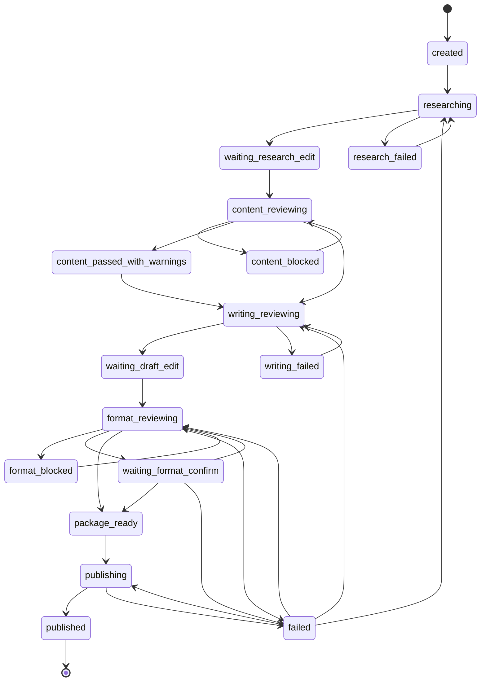

# 小红书医学/养生科普 Agent 详细设计文档

版本：v0.5  
日期：2026-06-04  
依据文档：[high_level_design.md](high_level_design.md)  
状态：详细设计草案，已根据修改建议修订  

## 1. 文档定位

本文档根据概要设计文档，细化系统的 Python 包结构、CLI 命令、配置格式、文件产物格式、模块接口、状态流转、错误处理和测试边界。

本文档仍不包含完整实现代码、完整提示词、真实 API Key、平台规则的最终数值清单或自动发布具体实现。后续实现时，应以本文档作为模块拆分和测试设计依据。

## 2. 技术选择

### 2.1 项目基础

项目是 `uv` 管理的 Python 工程，Python 包名为 `xiaohongshu_auto_publish`，CLI 命令为 `xhs-agent`。

当前已有开发依赖：

1. `pytest`：用于单元测试和模块级测试。
2. `mypy`：用于静态类型检查。
3. `ruff`：用于 lint 和格式化。

### 2.2 建议运行时依赖

用户已确认允许新增运行时依赖。实现阶段建议新增以下依赖：

| 依赖 | 用途 | 说明 |
| --- | --- | --- |
| `typer` | CLI 框架 | 默认命令行入口，建议固定主版本范围 |
| `openai` | OpenAI-compatible LLM 调用 | OpenAI、DeepSeek 和兼容服务统一接入，第一版应固定到已验证的次版本范围，例如 `>=1.40.0,<1.50.0`；升级前以兼容测试通过版本为准 |
| `tavily-python` | Tavily 联网检索 | 默认搜索实现，应通过接口替换，建议固定主版本范围 |
| `PyYAML` | Markdown YAML front matter 解析 | 仅用于阶段文件元数据，读取时必须使用 `yaml.safe_load()` |
| `filelock` | 跨平台文件锁 | 用于任务产物、状态文件和资产索引写入保护；优先使用成熟库，避免第一版手写 `fcntl`/`msvcrt` 适配 |

当前项目的 `pyproject.toml` 已声明 `requires-python = ">=3.13"`，但这会明显限制可用环境。实现前建议把最低版本下调到 `>=3.11`：Python 3.11 已包含 `tomllib`，可以继续使用标准库读取 TOML，同时比 3.13 更容易部署。如果后续决定支持 Python 3.10，则必须同步增加条件依赖 `tomli; python_version < "3.11"`，或放弃 `tomllib` 方案。

`.env` 可先用项目内置的简单解析器读取严格 `KEY=VALUE`，避免额外引入 `python-dotenv`。该解析器第一版只支持 ASCII/UTF-8 文本中的非空 `KEY=VALUE` 行；不支持引号、转义、变量展开、行内注释、空格包裹键名或 shell 语法。解析器遇到不符合格式的非空行应返回 `ConfigError`，而不是猜测用户意图。

`tomllib` 只负责读取 TOML。`xhs-agent init` 生成默认 `config.toml`、账号配置和规则文件时，应使用项目内置模板字符串写入，不为写配置额外引入 `tomli-w`。如果未来需要程序化修改 TOML，再单独评估写入库依赖。

实现阶段在 `pyproject.toml` 中应使用明确版本范围，优先固定已验证的次版本上限；`openai` 这类外部 SDK 不应只用主版本上限作为第一版默认范围。升级外部 SDK 前，应先跑 LLM 网关、结构化输出解析和集成流程兼容测试。

依赖版本选型与兼容性验证是 Phase 1 的入口任务。实现者应先确定 `typer`、`openai`、`tavily-python`、`PyYAML` 和 `filelock` 的版本范围，记录验证命令和通过结果，再开始依赖这些库的业务模块开发；后续升级 SDK 时必须复跑对应兼容测试。

## 3. 包结构设计

推荐使用 `src` 布局。

```text
src/
  xiaohongshu_auto_publish/
    __init__.py
    cli.py
    app.py
    errors.py
    models.py
    config/
      __init__.py
      loader.py
      schema.py
    orchestration/
      __init__.py
      orchestrator.py
      states.py
    interaction/
      __init__.py
      cli_adapter.py
    input/
      __init__.py
      normalizer.py
    artifacts/
      __init__.py
      store.py
      front_matter.py
    state/
      __init__.py
      store.py
    llm/
      __init__.py
      gateway.py
      prompts.py
    search/
      __init__.py
      provider.py
      tavily_provider.py
    source_policy/
      __init__.py
      policy.py
    research/
      __init__.py
      service.py
      renderer.py
    review/
      __init__.py
      content.py
      writing.py
      format.py
      output_parser.py
    rules/
      __init__.py
      format_rules.py
    media/
      __init__.py
      manifest.py
    account/
      __init__.py
      profile.py
    assets/
      __init__.py
      library.py
      lock.py
    maintenance/
      __init__.py
      archive.py
      cleanup.py
    package/
      __init__.py
      builder.py
    publish/
      __init__.py
      base.py
      manual.py
```

测试目录建议与包结构对应：

```text
tests/
  conftest.py          # pytest fixtures 和全局临时目录、Fake provider 注册
  fixtures/            # 共享测试数据文件，例如示例草稿、审核输出、manifest
  factories.py         # 测试数据工厂，生成任务、来源、审核报告和素材 manifest
  unit/
    test_config_loader.py
    test_artifact_store.py
    test_state_store.py
    test_orchestrator.py
    test_llm_gateway.py
    test_search_provider.py
    test_source_policy.py
    test_research_service.py
    test_content_review.py
    test_review_output_parser.py
    test_writing_review.py
    test_format_review.py
    test_media_manifest.py
    test_package_builder.py
    test_asset_library.py
    test_workspace_maintenance.py
    test_publish_manual.py
  integration/
    test_topic_workflow_with_fakes.py
    test_article_workflow_with_fakes.py
```

测试目录应随包结构同步维护。上表是第一版实现的最低建议清单；新增模块时，应补充对应单元测试或在 PR 中说明为什么仅由集成测试覆盖。

## 4. CLI 命令设计

CLI 由 Typer 实现，只负责参数解析、输出结果和提交用户确认，不直接包含业务逻辑。

### 4.1 命令清单

```text
xhs-agent init
xhs-agent topic "<topic>"
xhs-agent import <article_path>
xhs-agent continue <task_id>
xhs-agent retry <task_id>
xhs-agent status <task_id>
xhs-agent list
xhs-agent review-content <task_id>
xhs-agent review-writing <task_id>
xhs-agent review-format <task_id>
xhs-agent package <task_id>
xhs-agent rollback <task_id> --to-phase <phase>
xhs-agent publish <task_id>
xhs-agent cleanup [--dry-run|--apply]
xhs-agent archive <task_id>
xhs-agent accounts list
xhs-agent accounts show <account_id>
xhs-agent config-check
```

### 4.2 命令说明

| 命令 | 作用 |
| --- | --- |
| `init` | 初始化 `config.toml` 示例、规则文件示例、账号配置示例和 `workspace` 目录 |
| `topic` | 从选题大方向创建任务并启动调研 |
| `import` | 从已有 Markdown 文章创建任务 |
| `continue` | 根据任务当前状态继续执行下一阶段 |
| `retry` | 对当前可恢复失败阶段重新执行，保留既有完整产物 |
| `status` | 查看任务状态、最新产物路径和待处理动作 |
| `list` | 列出本地任务 |
| `review-content` | 手动触发内容审核 |
| `review-writing` | 手动触发写作审核与润色 |
| `review-format` | 手动触发格式审核 |
| `package` | 生成最终发布包 |
| `rollback` | 非破坏性回退任务指针到指定流程阶段，保留所有既有产物并写入审计日志 |
| `publish` | 调用发布通道；本阶段默认只支持手动发布辅助 |
| `cleanup` | 根据保留策略清理旧版本产物或已归档任务；默认先 dry-run 展示将处理的文件 |
| `archive` | 将指定任务移动到归档目录，保留任务状态、产物索引和审计日志 |
| `accounts list` | 列出可用账号画像 ID、默认账号和配置文件路径 |
| `accounts show` | 展示指定账号画像的非敏感配置摘要 |
| `config-check` | 检查配置文件、环境变量和必要密钥 |

### 4.3 关键参数

`topic` 命令建议参数：

```text
xhs-agent topic "<topic>" \
  --account default \
  --style popular \
  --audience "<target_audience>" \
  --series true \
  --length medium \
  --slug sleep-metabolism
```

`import` 命令建议参数：

```text
xhs-agent import ./article.md \
  --topic "<topic>" \
  --account default \
  --style balanced
```

风格枚举：

1. `popular`：通俗种草，默认值。
2. `professional`：专业严谨。
3. `balanced`：平衡风格。

关键参数说明：

| 参数 | 适用命令 | 含义 | 默认值 |
| --- | --- | --- | --- |
| `--account` | `topic`、`import` | 账号画像 ID，对应 `accounts/<account_id>.toml` | `default` |
| `--style` | `topic`、`import` | 写作风格枚举：`popular`、`professional`、`balanced` | `popular` |
| `--audience` | `topic` | 本篇目标读者描述，优先覆盖账号默认受众 | 账号配置 |
| `--series` | `topic` | 是否生成系列化选题建议 | `false` |
| `--length` | `topic` | 目标篇幅枚举：`short`、`medium`、`long` | `medium` |
| `--slug` | `topic`、`import` | 手动指定任务 ID 中的 slug，用于避免自动 slug 不清晰或冲突 | 自动生成 |
| `--to-phase` | `rollback` | 指定回退目标流程阶段，例如 `research`、`draft`、`format`；该参数不表示任务状态 `status` | 无 |
| `--config` | 全局 | 指定配置文件路径 | `config.toml` |
| `--set key=value` | 全局 | 使用点号路径覆盖嵌套配置，例如 `--set llm.timeout_seconds=120` | 无 |
| `--yes` | `continue`、`package`、`publish` | 跳过交互确认，仅用于非阻断确认点 | `false` |
| `--force-parse` | `review-content` | 对部分可解析的 LLM 审核输出生成诊断型报告；任务仍进入人工介入，不得绕过 S0/S1、schema 错误、关键风险字段错误或完全无法解析的输出 | `false` |
| `--prompt-policy` | `continue`、`retry` | 提示词版本策略：`locked` 使用任务创建或首次执行时记录的版本，`latest` 显式切换到当前注册表最新版本 | `locked` |
| `--manual-review-note` | `continue`、`review-content` | 人工覆盖内容审核阻断时必填的理由说明；普通继续流程不需要 | 无 |

`--yes` 不得绕过 S0/S1 内容阻断、部分或完全无法解析的 LLM 审核输出、schema 错误、关键风险字段错误、格式 `block` 问题或素材缺失问题。

## 5. 配置设计

### 5.1 配置文件

默认配置文件为项目根目录的 `config.toml`。

示例：

```toml
[llm]
provider = "openai-compatible"
base_url = "https://api.openai.com/v1"
model = ""
api_key_env = "XHS_AGENT_LLM_API_KEY"
timeout_seconds = 60
max_retries = 2

[search]
provider = "tavily"
api_key_env = "XHS_AGENT_TAVILY_API_KEY"
max_results = 8
timeout_seconds = 30

[storage]
workspace_dir = "workspace"
artifact_version_digits = 3

[retention]
keep_recent_versions = 5
keep_task_days = 180
archive_dir = "workspace/archive"
cleanup_dry_run_default = true

[writing]
default_style = "popular"
title_candidates = 5
enable_series_suggestions = true

[source_policy]
config_path = "rules/source_policy.toml"

[format_rules]
config_path = "rules/xhs_format_rules.toml"

[account]
profiles_dir = "accounts"
default_account = "default"

[publish]
enabled = false
default_channel = "manual"
require_confirm_before_publish = true
```

### 5.2 环境变量

默认从 `.env` 和系统环境变量读取密钥。系统环境变量优先级高于 `.env`。

示例：

```env
XHS_AGENT_LLM_API_KEY=
XHS_AGENT_TAVILY_API_KEY=
```

`.env` 只支持简单 `KEY=VALUE` 格式。实现阶段不应支持复杂 shell 语法，避免解析行为不可控。`KEY` 必须匹配 `[A-Za-z_][A-Za-z0-9_]*`；文档和 `init` 示例应继续推荐全大写变量名，但解析器不因小写或混合大小写本身报错。`VALUE` 按等号右侧原文读取并去掉行尾换行，不去除成对引号、不展开 `${VAR}`，也不把 `#` 视为行内注释。空行可忽略；其他不符合格式的非空行必须报错并提示改成标准 `KEY=VALUE`，不得静默忽略。

默认环境变量必须使用项目专用前缀 `XHS_AGENT_`，避免与其他小红书相关本地工具的变量冲突。兼容旧变量名不是第一版要求；如后续需要兼容，应在 `config-check` 中明确提示实际读取的是哪个变量。

### 5.3 加载优先级

配置加载顺序：

1. 默认配置。
2. `config.toml`。
3. `.env`。
4. 系统环境变量。
5. CLI 参数覆盖项。

CLI 覆盖项统一使用点号路径表达嵌套配置，例如 `--set llm.timeout_seconds=120`、`--set search.max_results=5`。覆盖只允许作用于已声明配置字段，不允许用一个字符串替换整个嵌套表；加载后必须做类型转换和合理性校验。

敏感值只保存为环境变量名或运行时内存值，不写入阶段产物、日志或审核报告。

## 6. 工作区与产物设计

### 6.1 任务目录

任务目录位于 `workspace/<task_id>/`。

推荐结构：

```text
workspace/
  <task_id>/
    task.json
    artifacts.jsonl
    audit_log.jsonl
    research/
      research.v001.md
      sources.v001.md
    drafts/
      draft.v001.md
      revised.v001.md
    reviews/
      content_review.v001.md
      writing_review.v001.md
      format_review.v001.md
    package/
      final_package.v001.md
      publish_manifest.v001.json
    media/
      media_manifest.json
      images/
```

`task.json`、`artifacts.jsonl` 和 `audit_log.jsonl` 是机器读取文件。Markdown 文件是用户可读、可编辑的阶段产物。

### 6.2 文件命名

文件命名格式：

```text
<artifact_kind>.v<version>.<extension>
```

示例：

```text
research.v001.md
draft.v002.md
content_review.v003.md
final_package.v001.md
```

流程状态不得依赖某个固定文件名。最新产物应通过 `artifacts.jsonl` 中的索引判断。

### 6.3 Markdown front matter

所有阶段 Markdown 文件允许带 YAML front matter。

示例：

```markdown
---
task_id: "20260604-sleep-metabolism"
artifact_id: "research-001"
stage: "research"
kind: "research"
version: 1
created_at: "2026-06-04T12:00:00+08:00"
source_artifacts: []
user_editable: true
status: "waiting_user_edit"
---

# 调研资料
```

front matter 用于追踪任务、阶段、版本和来源关系。Markdown 正文仍以用户可读为主。

读取 front matter 时必须使用 `yaml.safe_load()`，并将空 front matter 视为 `{}`。不得使用 `yaml.load()` 或执行任意 Python 对象反序列化。

为避免异常 YAML 输入造成资源耗尽，解析流程分两层限制：

1. 解析前只做原始文本级限制：front matter 不得超过 32KB，即实现常量 `MAX_FRONT_MATTER_SIZE = 32 * 1024`；不得包含显式 YAML tag，尤其是 `!python`、`!!python` 或其他 `!<tag>` 形式；不得包含异常大量的 anchor/alias 标记。
2. `yaml.safe_load()` 成功后，再对解析结果做递归结构校验：只允许标量、列表和字典；最大嵌套深度必须不超过 5 层；总键数量必须不超过 100；字典键必须是字符串。

超限或校验失败时返回 `ArtifactError`，不得继续解析。嵌套深度和键数量属于解析后校验项，不要求在解析前推断。这些安全上限必须作为解析器常量或等价硬编码配置进入实现，并由单元测试覆盖，不得作为可被普通配置放宽的建议值。

### 6.4 审核报告追溯说明

所有审核报告除了在 front matter 中记录 `source_artifacts`，正文顶部也应用人类可读格式说明本次审核针对的源产物，例如：

```markdown
本次审核对象：draft.v002.md
源产物 ID：draft-002
```

当用户修改草稿并重新审核时，审核报告版本号和草稿版本号可以不同，但必须通过 `source_artifacts` 和正文说明建立明确追溯关系。`artifacts.jsonl` 是机器追溯入口，正文说明是人工排查入口。

## 7. 核心数据模型

实现阶段优先使用 `dataclasses`、`Enum` 和类型注解；复杂校验通过模块内部函数完成。暂不引入 Pydantic。

### 7.1 枚举

```python
from enum import StrEnum


class TaskStatus(StrEnum):
    CREATED = "created"
    RESEARCHING = "researching"
    RESEARCH_FAILED = "research_failed"
    WAITING_RESEARCH_EDIT = "waiting_research_edit"
    CONTENT_REVIEWING = "content_reviewing"
    CONTENT_BLOCKED = "content_blocked"
    CONTENT_PASSED_WITH_WARNINGS = "content_passed_with_warnings"
    WRITING_REVIEWING = "writing_reviewing"
    WRITING_FAILED = "writing_failed"
    WAITING_DRAFT_EDIT = "waiting_draft_edit"
    FORMAT_REVIEWING = "format_reviewing"
    FORMAT_BLOCKED = "format_blocked"
    WAITING_FORMAT_CONFIRM = "waiting_format_confirm"
    PACKAGE_READY = "package_ready"
    PUBLISHING = "publishing"
    PUBLISHED = "published"
    FAILED = "failed"


class Severity(StrEnum):
    S0 = "S0"
    S1 = "S1"
    S2 = "S2"
    S3 = "S3"


class WritingStyle(StrEnum):
    POPULAR = "popular"
    PROFESSIONAL = "professional"
    BALANCED = "balanced"


class ParseStatus(StrEnum):
    OK = "ok"
    PARTIAL = "partial"
    FAILED = "failed"
```

### 7.2 主要模型

| 模型 | 关键字段 |
| --- | --- |
| `TaskMetadata` | `task_id`、`input_type`、`topic`、`account_id`、`style`、`audience`、`status`、`created_at`、`updated_at`、`retry_counts`、`last_failed_stage`、`last_error`、`prompt_versions` |
| `ArtifactRef` | `artifact_id`、`task_id`、`stage`、`kind`、`version`、`path`、`created_at`、`source_artifacts`、`user_editable`、`complete`、`error_type`、`retryable` |
| `SourceRecord` | `url`、`title`、`organization`、`published_at`、`retrieved_at`、`credibility`、`relevance`、`notes` |
| `ReviewIssue` | `location`、`quote`、`issue_type`、`severity`、`risk`、`suggestion`、`blocking` |
| `ReviewReport` | `task_id`、`stage`、`issues`、`blocking`、`summary`、`model`、`created_at`、`source_artifacts`、`raw_output_excerpt`、`manual_override`、`parse_status`、`parse_warnings` |
| `MediaItem` | `path`、`role`、`width`、`height`、`ratio`、`description`、`is_cover_candidate` |
| `PublishPackage` | `title`、`body`、`hashtags`、`media_items`、`cover_title`、`source_records`、`review_summary`、`media_validation_passed`、`user_confirmed`、`can_publish` |
| `AccountProfile` | `account_id`、`positioning`、`audience`、`tone`、`forbidden_phrases`、`style_examples`、`conversion_strategy` |

`TaskMetadata.task_id` 生成规则：

1. 格式为 `YYYYMMDD-<slug>-<rand4>`，例如 `20260604-sleep-metabolism-a3f9`。
2. `YYYYMMDD` 使用任务创建时的本地日期。
3. `<slug>` 优先使用用户传入的 `--slug`，再从选题或导入文件名生成：转小写、保留英文数字，把空格、下划线和连字符归一为单个 `-`；中文转拼音不是第一版要求。
4. 未传入 `--slug` 且选题或文件名主要由中文或其他非 ASCII 字符组成时，第一版直接丢弃非 ASCII 字符；如果归一化后无法生成有效 slug，则使用通用 slug `topic`，并在 CLI 输出中提示用户可用 `--slug` 指定更清晰的英文短名。
5. `<rand4>` 使用 4 位十六进制随机串。
6. 如果目录已存在，先使用同一 `<slug>` 重新生成 `<rand4>`，最多重试 5 次。
7. 如果 5 次仍冲突，自动在 slug 后追加递增后缀，例如 `<slug>-2`、`<slug>-3`，每个后缀继续生成新的 `<rand4>`；总候选尝试次数必须上限为 30 次，避免极端冲突时长时间阻塞。
8. 所有候选目录创建都必须使用独占创建语义，不得先检查后创建导致竞态覆盖。
9. 达到总尝试上限仍冲突时返回 `StateError`，不得覆盖已有任务。`StateError` 中必须包含本次尝试过的 task_id 列表，并建议用户使用 `--slug` 指定更明确的 slug。

## 8. 模块详细设计

### 8.1 交互适配模块

文件：

1. `cli.py`
2. `interaction/cli_adapter.py`

职责：

1. 定义 Typer app 和命令。
2. 将 CLI 参数转换为编排层请求对象。
3. 打印任务状态、文件路径、阻断问题和下一步命令。
4. 处理用户确认参数，例如 `--yes` 或交互式确认。

主要依赖：

1. `WorkflowOrchestrator`
2. `ConfigLoader`

可测试接口：

1. CLI 命令参数解析。
2. CLI 输出内容。
3. CLI 对编排层调用参数。

Mock 依赖：

1. Mock `WorkflowOrchestrator`。
2. 使用 Typer testing runner。

关键测试用例：

1. `topic` 命令能把选题、账号、风格传给编排层。
2. `import` 命令在文件不存在时返回可读错误。
3. `status` 命令能展示当前状态和最新产物路径。
4. `continue` 命令能根据编排层返回结果展示下一步操作。

### 8.2 流程编排模块

文件：

1. `orchestration/orchestrator.py`
2. `orchestration/states.py`

职责：

1. 管理任务创建、继续、重试和终止。
2. 根据任务状态调用下游模块。
3. 执行 S0/S1 内容审核阻断。
4. 执行格式审核阻断和发布前确认。
5. 保存状态、部分完成结果和审核记录。
6. 在外部调用失败后支持从最近可用产物恢复。

核心方法：

```python
create_from_topic(...)
create_from_article(...)
continue_task(task_id: str, confirmed: bool = False, force_parse: bool = False)
retry_task(task_id: str)
rollback_task(task_id: str, to_phase: str)
get_status(task_id: str)
run_content_review(task_id: str)
run_writing_review(task_id: str)
run_format_review(task_id: str)
build_package(task_id: str)
publish(task_id: str, confirmed: bool)
```

失败恢复规则：

1. 重试不是独立状态。每个阶段在 `task.json.retry_counts[stage]` 中记录尝试次数，在 `last_error` 中记录最近错误摘要、错误类型、阶段、是否可重试和相关产物。
2. 进入外部调用前写入对应执行中状态，例如 `researching`、`content_reviewing`、`writing_reviewing`、`format_reviewing` 或 `publishing`；可重试失败由编排层在同一阶段内部重试。
3. 超过阶段重试次数后进入稳定状态：调研失败进入 `research_failed`，写作失败进入 `writing_failed`，格式阻断进入 `format_blocked`，发布包生成或发布通道失败进入通用 `failed` 并设置 `last_failed_stage`。
4. `continue_task()` 对失败状态默认从 `last_failed_stage` 重新执行，不回滚已成功写入的上一阶段产物。
5. `retry_task()` 只允许在 `research_failed`、`content_blocked`、`writing_failed`、`format_blocked`、`failed` 等可恢复状态调用；调研失败重试时必须重新扫描用户编辑过的 `sources.vNNN.md`。
6. 下游模块若已产生部分结果，必须通过 `ArtifactStore` 写入 `artifacts.jsonl`，并标记 `complete=false`、`error_type` 和 `retryable`。
7. `rollback_task()` 只回退任务指针和下一步动作，不删除或覆盖既有产物；回退必须指定目标流程阶段 `phase`，例如 `research`、`draft`、`format`，并把原因写入 `audit_log.jsonl`。`phase` 是面向 CLI 的流程位置，不等同于 `TaskStatus.status` 或产物 front matter 中的 `stage` 字段。
8. `status` 命令必须展示最近完整产物、最近部分产物、失败原因、重试次数和推荐下一步命令。

状态复杂度控制：

1. 第一版保留显式状态，原因是 CLI 需要清楚区分“等待用户编辑”“审核阻断”“外部调用失败”和“发布前确认”等用户可见场景。
2. 实现时不得在业务代码中散落硬编码状态判断。应在 `orchestration/states.py` 中维护集中状态迁移表，表项至少包含当前状态、触发事件、目标状态、是否需要用户确认、是否允许重试和失败阶段。
3. 状态对象可以额外包含 `stage`、`requires_user_action`、`blocking_reason`、`last_failed_stage` 等字段，用于减少状态枚举继续膨胀；新增枚举状态前必须先说明为什么这些字段不能表达。
4. 实现阶段必须为状态迁移表生成或维护测试矩阵，覆盖允许迁移、禁止迁移、确认参数、失败重试和 rollback 分支。

幂等性约定：

| 操作 | 幂等性 | 恢复策略 |
| --- | --- | --- |
| `create_from_topic` | 非幂等 | 生成唯一 `task_id` 后创建新目录；如果目录已存在直接失败 |
| `create_from_article` | 非幂等 | 同上，不覆盖已有任务 |
| 调研搜索 | 可重试但结果可能变化 | 保存原始搜索结果快照；重试生成新版本 |
| LLM 调研汇总 | 可重试但输出可能变化 | 每次重试写新版本，不覆盖旧版本 |
| 内容审核 | 幂等输入下近似幂等 | 针对同一 `source_artifacts` 写新审核报告版本 |
| 写作润色 | 可重试但输出可能变化 | 写新 `revised` 和 `writing_review` 版本 |
| 格式审核 | 对同一文本和素材幂等 | 可复用最新检查结果，但重新执行时仍写新报告 |
| 发布包生成 | 对同一确认状态和素材幂等 | 每次构建前重新校验素材并写新 manifest |
| 手动发布辅助 | 幂等 | 只生成辅助信息，不访问平台 |

状态迁移规则：

| 当前状态 | 触发 | 下一状态 |
| --- | --- | --- |
| `created` | 从选题创建 | `researching` |
| `researching` | 调研完成 | `waiting_research_edit` |
| `researching` | 超过重试次数、无可用来源或用户需补充权威来源 | `research_failed` |
| `research_failed` | 用户补充来源或选择重试 | `researching` |
| `waiting_research_edit` | 用户确认继续 | `content_reviewing` |
| `content_reviewing` | 存在 S0/S1 | `content_blocked` |
| `content_reviewing` | 审核输出部分解析、完全无法解析、schema 校验失败或关键风险字段错误 | `content_blocked` |
| `content_reviewing` | 无阻断但有 S2/S3 | `content_passed_with_warnings` |
| `content_reviewing` | 无问题 | `writing_reviewing` |
| `content_blocked` | 用户修改后继续 | `content_reviewing` |
| `content_blocked` | 用户手动补充合法审核报告、填写人工审核理由并确认 | `writing_reviewing` |
| `content_passed_with_warnings` | 用户确认继续 | `writing_reviewing` |
| `writing_reviewing` | 润色完成 | `waiting_draft_edit` |
| `writing_reviewing` | 超过重试次数或无法生成可用稿件 | `writing_failed` |
| `writing_failed` | 用户选择重试 | `writing_reviewing` |
| `waiting_draft_edit` | 用户确认继续 | `format_reviewing` |
| `format_reviewing` | 未通过 | `format_blocked` |
| `format_reviewing` | 存在 `confirm` 问题 | `waiting_format_confirm` |
| `format_reviewing` | 通过且发布包生成成功 | `package_ready` |
| `format_reviewing` | 通过但发布包生成失败或素材复验失败 | `failed` |
| `waiting_format_confirm` | 用户确认接受风险且发布包生成成功 | `package_ready` |
| `waiting_format_confirm` | 用户确认后发布包生成失败或素材复验失败 | `failed` |
| `waiting_format_confirm` | 用户修改后继续 | `format_reviewing` |
| `package_ready` | 启用发布且确认 | `publishing` |
| `publishing` | 成功 | `published` |
| `publishing` | 超过重试次数或不可重试失败 | `failed` |
| `failed` | 根据 `last_failed_stage` 修复后重试 | 对应执行中状态 |

状态图示：



Mock 依赖：

1. `InputNormalizer`
2. `ResearchService`
3. `ContentReviewService`
4. `WritingReviewService`
5. `FormatReviewService`
6. `PackageBuilder`
7. `Publisher`
8. `ArtifactStore`
9. `StateStore`

关键测试用例：

1. 从选题创建任务后进入 `waiting_research_edit`。
2. 内容审核返回 S0 时进入 `content_blocked`，且不调用写作审核。
3. 内容审核只有 S2/S3 时要求用户确认后才能进入写作审核。
4. 格式审核失败时不生成最终发布包。
5. 发布前未确认时不调用发布通道。
6. 临时失败只增加阶段重试计数，不产生 `*_retrying` 状态。
7. `rollback_task()` 不删除产物，只更新任务指针并追加审计事件。
8. 状态迁移测试矩阵覆盖每个状态的合法触发和至少一个非法触发。

### 8.3 选题/文章输入模块

文件：

1. `input/normalizer.py`

职责：

1. 规范化选题输入。
2. 读取已有 Markdown 文件或文本。
3. 生成初始 `TaskMetadata`。
4. 生成初始草稿或选题说明 Markdown。

输入：

1. 选题文本。
2. 文章路径或文章正文。
3. 账号 ID、风格、目标受众、篇幅和系列化标记。

输出：

1. `TaskMetadata`
2. 初始 `ArtifactRef`

Mock 依赖：

1. 文件系统读取可使用临时目录。
2. 不依赖 LLM。

关键测试用例：

1. 选题为空时返回校验错误。
2. Markdown 文件存在时正确读取 UTF-8 内容。
3. 粘贴文本能生成初始草稿。
4. 风格缺省时使用 `popular`。

### 8.4 阶段产物存储模块

文件：

1. `artifacts/store.py`
2. `artifacts/front_matter.py`

职责：

1. 保存 Markdown 产物和 JSON 发布清单。
2. 写入和读取 YAML front matter。
3. 维护 `artifacts.jsonl` 索引。
4. 查询某任务某阶段最新产物。
5. 支持同阶段多版本。

核心方法：

```python
save_markdown(task_id, stage, kind, body, front_matter, user_editable) -> ArtifactRef
save_partial(task_id, stage, kind, body, front_matter, error, retryable) -> ArtifactRef
read_markdown(artifact_ref) -> MarkdownDocument
latest(task_id, stage, kind | None = None) -> ArtifactRef | None
list_artifacts(task_id, stage | None = None) -> list[ArtifactRef]
```

文件写入要求：

1. 使用 UTF-8。
2. 路径必须限制在 `workspace_dir` 内。
3. 版本号分配必须在任务级锁内完成，锁文件建议为 `workspace/<task_id>/artifacts.lock`，第一版优先使用 `filelock.FileLock` 实现跨平台锁。
4. 分配版本时先扫描目录和 `artifacts.jsonl` 得到同阶段同类型最大版本号，再尝试创建下一个版本。
5. 版本化产物不得用 `os.replace()` 覆盖目标文件。必须使用独占创建，例如 `open(path, "xb")` 或 `os.open(..., O_CREAT | O_EXCL)`；如目标已存在，重新扫描后最多重试 8 次，并使用短指数退避降低高并发下的误失败概率。
6. 独占创建成功后写入完整内容、flush 并按平台能力执行 fsync；写入失败时删除未完成目标文件，并记录 `ArtifactError`。
7. `artifacts.jsonl` 追加必须与版本文件创建处于同一个任务级锁保护范围内；追加后立即 flush。
8. 对非版本化机器文件，例如 `task.json`，可使用“临时文件 + 原子替换”，但替换前仍应持有对应状态锁。

`artifacts.jsonl` 记录字段至少包括：

1. `artifact_id`
2. `task_id`
3. `stage`
4. `kind`
5. `version`
6. `path`
7. `source_artifacts`
8. `complete`
9. `error_type`
10. `retryable`
11. `created_at`

部分完成产物必须 `complete=false`，并保留可诊断的错误类型和上游产物引用。读取最新可用产物时，默认只返回 `complete=true` 的产物；诊断和 `status` 命令可以显式查询部分产物。

Mock 依赖：

1. 使用 pytest `tmp_path`。
2. 不依赖 LLM、搜索或编排层。

关键测试用例：

1. 保存 Markdown 后可以读取 front matter 和正文。
2. 同阶段多次保存生成递增版本。
3. `latest` 返回最新版本。
4. 非法路径不能逃逸 `workspace_dir`。
5. 部分完成产物不会被误认为可继续流程的完整产物。
6. 并发保存同阶段产物时不会分配重复版本号。
7. 版本号冲突重试超过上限时返回可读 `ArtifactError`，错误中应包含已尝试的版本号和建议用户稍后重试。

### 8.5 状态与审核记录模块

文件：

1. `state/store.py`

职责：

1. 维护 `task.json`。
2. 追加写入 `audit_log.jsonl`。
3. 保存任务状态、审核摘要、确认记录和发布结果。
4. 支持续跑。
5. 记录失败阶段、失败原因、重试次数和最近一次可恢复动作。

核心方法：

```python
create_task(metadata: TaskMetadata)
get_task(task_id: str) -> TaskMetadata
update_status(task_id: str, status: TaskStatus)
record_failure(task_id: str, stage: str, error: XHSError, retryable: bool)
increment_retry(task_id: str, stage: str) -> int
append_audit_event(task_id: str, event: AuditEvent)
list_tasks() -> list[TaskMetadata]
```

`task.json` 应保存：

1. 当前 `status`。
2. 每个阶段的 `retry_counts`。
3. 最近失败阶段 `last_failed_stage`。
4. 最近失败原因对象 `last_error`，至少包含 `summary`、`error_type`、`stage`、`retryable`、`related_artifacts`。
5. 下一步建议动作 `next_action`。
6. 当前任务使用过的提示词版本 `prompt_versions`，按提示词类型记录。
7. 最近一次人工覆盖信息 `manual_overrides`，用于追踪用户确认或手动审核报告。

`audit_log.jsonl` 只追加，不重写。状态更新、用户确认、人工审核报告、回滚、发布尝试和失败恢复必须写入审计记录，便于解释为什么某个阻断被解除。

审计事件 schema 至少包括：

1. `event_id`
2. `task_id`
3. `event_type`
4. `stage`
5. `from_status`
6. `to_status`
7. `artifact_ids`
8. `summary`
9. `created_at`
10. `user_confirmed`

Mock 依赖：

1. 使用临时目录。

关键测试用例：

1. 创建任务后能读取状态。
2. 状态更新能持久化。
3. 审核事件以 JSON Lines 追加。
4. 损坏的状态文件返回清晰错误。
5. 失败状态可被读取并通过 `retry_task()` 继续。
6. 回滚和人工覆盖事件会写入审计日志。

### 8.6 配置管理模块

文件：

1. `config/loader.py`
2. `config/schema.py`

职责：

1. 读取默认配置、`config.toml`、`.env`、系统环境变量和 CLI 覆盖项。
2. 校验必要配置。
3. 返回结构化配置对象。
4. 不把密钥写入日志和阶段产物。
5. 为 `init` 命令提供默认配置模板内容。
6. 校验配置值合理性，例如超时时间必须为正数、重试次数不能为负数、规则路径必须位于允许范围内。
7. 校验 `.env` 的 KEY 匹配 `[A-Za-z_][A-Za-z0-9_]*`；小写和混合大小写允许解析，但不符合格式的非空行必须返回 `ConfigError`。
8. 读取和校验保留策略配置，例如保留版本数、任务保留天数、归档目录和 cleanup 默认 dry-run 行为。

核心方法：

```python
load_config(config_path: Path | None, env_path: Path | None, overrides: Mapping[str, str]) -> AppConfig
check_required_secrets(config: AppConfig) -> list[ConfigIssue]
```

Mock 依赖：

1. 临时 `config.toml`。
2. 临时 `.env`。
3. monkeypatch 环境变量。

关键测试用例：

1. 系统环境变量覆盖 `.env`。
2. CLI 覆盖项优先级最高。
3. 缺少 LLM API Key 时返回清晰错误。
4. `config.toml` 格式错误时返回文件路径和解析错误。
5. `init` 命令使用模板字符串生成 TOML，不依赖 TOML 写入库。
6. `config-check` 会展示缺失的 `XHS_AGENT_` 环境变量名，但不展示密钥值。
7. `config-check` 会报告负数超时、非法重试次数和未知 CLI 覆盖键。
8. `.env` 中 KEY 格式非法时返回 `ConfigError`，不得静默忽略；小写或混合大小写变量名可解析，但 `init` 和示例仍推荐全大写。
9. 保留策略配置非法时返回可读错误，例如负数天数、归档目录逃逸工作区或保留版本数小于 1。

### 8.7 LLM 网关模块

文件：

1. `llm/gateway.py`
2. `llm/prompts.py`

职责：

1. 使用 OpenAI-compatible client 调用模型。
2. 统一 OpenAI、DeepSeek 和兼容供应商。
3. 提供结构化请求和响应。
4. 处理超时、重试、速率限制和模型错误。

核心接口：

```python
class LLMGateway:
    def complete(self, request: LLMRequest) -> LLMResponse: ...
    # 预留扩展点，第一版不要求实现：
    # def complete_streaming(self, request: LLMRequest) -> Iterator[LLMChunk]: ...
```

第一版业务模块只依赖 `complete()` 的同步完整响应语义，避免把供应商特有的流式事件暴露到审核、调研或写作模块。若未来需要 CLI 实时显示生成进度，应通过 `complete_streaming()` 返回统一的 `LLMChunk`，并复用同一套超时、重试、审计和结构化输出解析边界。

`LLMRequest` 关键字段：

1. `system_prompt`
2. `user_prompt`
3. `response_format`
4. `temperature`
5. `metadata`

`LLMResponse` 关键字段：

1. `text`
2. `model`
3. `provider`
4. `usage`
5. `raw_id`
6. `raw_response`

业务模块需要结构化输出时，不应直接信任 LLM 网关返回的文本。解析逻辑集中放在 `review/output_parser.py` 或对应解析器中，解析失败时必须返回包含原始输出摘要的错误对象，供审核报告和状态机记录。

Mock 依赖：

1. Mock OpenAI-compatible client。
2. Fake LLM 返回固定文本。

关键测试用例：

1. 正确使用 `base_url`、`model` 和 API Key。
2. 调用失败时按配置重试。
3. 超过重试次数后返回统一错误。
4. 业务模块可使用 Fake LLM 独立测试。

### 8.8 联网检索服务

文件：

1. `search/provider.py`
2. `search/tavily_provider.py`

职责：

1. 定义可替换的 `SearchProvider` 接口。
2. 默认使用 Tavily 实现。
3. 返回结构化搜索结果。
4. 支持超时、失败重试和错误反馈。

核心接口：

```python
class SearchProvider(Protocol):
    def search(self, query: str, max_results: int) -> list[SearchResult]: ...
```

`SearchResult` 关键字段：

1. `title`
2. `url`
3. `snippet`
4. `source_name`
5. `published_at`
6. `retrieved_at`

Mock 依赖：

1. Fake `SearchProvider`。
2. Mock Tavily client。

关键测试用例：

1. Tavily provider 能把外部响应映射为 `SearchResult`。
2. 缺少 Tavily API Key 时返回配置错误。
3. 搜索失败时返回可重试错误。
4. 调研模块可通过 Fake SearchProvider 独立测试。

### 8.9 来源策略/白名单模块

文件：

1. `source_policy/policy.py`

职责：

1. 读取 `rules/source_policy.toml`。
2. 对来源进行分类和可信度评分。
3. 标记白名单、灰名单、风险来源和未知来源。
4. 生成可信度说明。
5. 在规则文件缺失时加载内置最小可信来源清单。

规则文件示例：

```toml
[[trusted_sources]]
name = "WHO"
domain = "who.int"
level = "international_public_health"
priority = 1

[[trusted_sources]]
name = "CDC"
domain = "cdc.gov"
level = "international_public_health"
priority = 1

[[risk_sources]]
domain = "example-low-quality-health.com"
reason = "营销导向健康内容"
```

内置最小可信来源清单：

1. WHO：`who.int`
2. CDC：`cdc.gov`
3. NIH：`nih.gov`
4. FDA：`fda.gov`
5. NHS：`nhs.uk`
6. 国家卫生健康委：`nhc.gov.cn`

降级策略：

1. `rules/source_policy.toml` 缺失时，加载内置最小清单，并在调研报告中写入“使用内置来源策略”的提示。
2. 规则文件格式错误时，不静默降级；返回 `ConfigError`，要求用户修复规则文件。
3. 搜索结果全部为未知来源时，调研报告可以继续生成，但必须显著标记“来源可信度不足”。
4. 如果主题涉及疾病治疗、药物、剂量、诊断、孕产、儿童或慢病管理，而所有来源均为未知来源，调研模块应进入 `research_failed`，提示用户补充权威来源后再继续。
5. 未知来源不得被 LLM 总结包装成权威结论；内容审核应把证据不足作为风险项展示。

核心方法：

```python
evaluate(source: SourceRecord) -> SourceEvaluation
rank(sources: list[SourceRecord]) -> list[SourceRecord]
```

Mock 依赖：

1. 临时规则文件。

关键测试用例：

1. 白名单来源被识别为高可信。
2. 风险来源被标记并降低优先级。
3. 缺失发布日期时标记为 `published_at_unknown`。
4. 未知来源不会被错误标记为权威来源。
5. 规则文件缺失时能加载内置最小清单。
6. 高风险主题全未知来源时返回可恢复失败。

### 8.10 调研模块

文件：

1. `research/service.py`
2. `research/renderer.py`

职责：

1. 根据选题生成检索查询。
2. 调用 Tavily 搜索服务。
3. 使用来源策略排序和筛选来源。
4. 调用 LLM 汇总调研结果。
5. 渲染 `research.vNNN.md` 和 `sources.vNNN.md`。
6. 在高风险主题缺少权威来源时生成可操作的补充来源指引。
7. 重试时合并用户手动补充的来源和重新检索结果。

输入：

1. `TaskMetadata`
2. 选题、受众、账号定位、风格

输出：

1. 调研 Markdown
2. 来源 Markdown
3. `SourceRecord` 列表

用户补充来源机制：

1. `sources.vNNN.md` 必须设置 `user_editable=true`，并在正文中提供“用户补充来源”小节。
2. 补充来源建议使用表格字段：`url`、`title`、`organization`、`published_at`、`reason`。无法确认的字段允许填 `unknown`，但审核报告必须标记证据质量不足。
3. 高风险医学主题缺少权威来源时，调研模块应生成 `research_failed` 状态和明确下一步，例如“请在 `sources.vNNN.md` 的用户补充来源小节加入指南、共识、监管机构或医院科普链接，然后执行 `xhs-agent retry <task_id>`”。
4. `retry_task()` 重新进入调研前，必须读取最新 `sources.vNNN.md`，解析用户补充来源，去重后交给 `SourcePolicy.rank()`。
5. 用户补充来源不自动视为可信来源；仍需经过来源策略评分和内容审核引用。

Mock 依赖：

1. Fake `SearchProvider`
2. Fake `LLMGateway`
3. Fake `SourcePolicy`
4. Fake `ArtifactStore`

关键测试用例：

1. 调研输出包含来源链接、机构、发布日期或未知标记。
2. 搜索无结果时生成失败状态和可操作提示。
3. 来源策略排序结果影响调研输入顺序。
4. LLM 返回不完整时仍保留原始来源清单。
5. 用户在 `sources.vNNN.md` 补充来源后，重试会重新读取并合并来源。
6. 高风险主题缺少权威来源时，失败产物包含可执行的补充来源说明。

### 8.11 内容审核模块

文件：

1. `review/content.py`
2. `review/output_parser.py`

职责：

1. 读取最新用户编辑稿或调研稿。
2. 调用 LLM 进行医学事实、健康风险、平台合规和误导风险审核。
3. 使用来源策略辅助判断证据质量。
4. 解析结构化审核结果。
5. 渲染 `content_review.vNNN.md`。
6. 返回是否阻断。
7. 根据结构化输出解析状态生成通过、警告或阻断型审核报告。

结构化输出要求：

```json
{
  "summary": "...",
  "blocking": true,
  "issues": [
    {
      "location": "第 3 段",
      "quote": "...",
      "issue_type": "危险用药建议",
      "severity": "S0",
      "risk": "...",
      "suggestion": "...",
      "blocking": true
    }
  ]
}
```

LLM 输出解析异常时，应返回解析状态并保留安全截断后的原始文本摘要，不能默默放过。

关键风险字段定义：

1. 根对象关键字段：`summary`、`blocking`、`issues`。
2. 每个 `issues[]` 条目的关键风险字段：`issue_type`、`severity`、`risk`、`blocking`、`suggestion`。
3. 非关键但建议字段：`location`、`quote`。缺失时可以写入解析警告，但不得单独导致阻断。
4. `severity` 只能是 `S0`、`S1`、`S2`、`S3`；`blocking` 必须是布尔值。类型不匹配按关键字段缺失处理。

结构化输出应优先在 LLM 请求层使用 JSON Schema 或兼容服务支持的结构化输出能力，要求根对象和关键风险字段必填。若当前 OpenAI-compatible provider 不支持请求层 schema，也必须在本地解析器中用同一份 schema 做校验，不得只依赖提示词描述。

解析失败处理要求：

1. `ParseStatus.OK`：结构完整，按 `issues` 和 `blocking` 正常推进。缺失 `location`、`quote` 等非关键字段时仍可保持 `OK`，但必须写入 `parse_warnings`。
2. `ParseStatus.PARTIAL`：只作为诊断状态，不作为可继续流程的通过状态。只要解析器返回 `PARTIAL`，编排层必须进入 `content_blocked`，报告中可展示已解析出的候选问题，但不得据此进入 `content_passed_with_warnings` 或写作审核。
3. 如果根对象缺失 `summary`、`blocking` 或 `issues`，解析器应返回 `StructuredOutputSchemaError`，编排层进入 `content_blocked`，因为流程无法判断是否可以继续。
4. 如果单个问题缺失 `issue_type`、`severity`、`risk`、`blocking` 或 `suggestion` 等关键风险字段，应返回 `StructuredOutputRiskFieldError`，在报告中把该问题标记为“需人工复核”。该类问题不得自动通过；用户修复草稿或补充人工审核报告后才能继续。
5. `ParseStatus.FAILED`：完全无法解析、根结构错误、没有可用问题列表且无法判断风险时，生成阻断型审核报告，编排层进入 `content_blocked`。
6. `content_review.vNNN.md` 必须记录解析状态、解析警告、模型信息、原始 LLM 输出的安全截断版本和建议下一步。
7. 原始输出不得包含 API Key、系统提示词全文或其他敏感配置。
8. `--force-parse` 只允许把 `ParseStatus.PARTIAL` 的候选结果写成诊断型审核报告，便于人工排查；不得强行通过 `ParseStatus.PARTIAL`、`ParseStatus.FAILED`、`StructuredOutputSchemaError`、`StructuredOutputRiskFieldError` 或绕过 S0/S1。
9. 用户可以手动编辑或创建审核报告后继续，但报告 front matter 必须包含 `manual_override: true`、`reviewer_note` 和 `source_artifacts`。
10. 人工审核报告必须逐条列出原 S0/S1 或关键风险字段问题的修复说明，不能只写“已确认”或“风险可接受”。
11. 审计日志必须记录人工覆盖的理由、审核者标识、源草稿 artifact、源审核报告 artifact、执行命令和时间。
12. 触发人工覆盖继续流程时，CLI 必须要求 `--manual-review-note "理由"` 或等价交互输入；`--yes` 不得替代该理由。
10. 编排层接受人工报告前，必须确认该报告明确写出阻断项是否已修复，并写入 `audit_log.jsonl`。
11. 实现 `review/output_parser.py` 前，必须先维护一份决策表或状态图，覆盖 `OK`、`PARTIAL`、`FAILED`、schema 错误、关键风险字段错误、S0/S1 和人工覆盖的所有组合；代码和测试应以该决策表为准。

Mock 依赖：

1. Fake `LLMGateway`
2. Fake `SourcePolicy`
3. Fake `ArtifactStore`

关键测试用例：

1. S0/S1 问题会设置 `blocking=true`。
2. S2/S3 问题会展示但不阻断。
3. 所有问题都写入 Markdown 审核报告。
4. LLM 输出非法 JSON 时返回可读错误。
5. 审核模块不直接推进流程状态。
6. 完全解析失败报告会阻断流程且包含源产物追溯信息。
7. 部分解析成功时会生成诊断型报告，并进入 `content_blocked` 等待人工介入。
8. 非关键字段缺失不阻断，但会写入解析警告。
9. `--force-parse` 不能让缺失关键风险字段的问题通过。
10. `ParseStatus.PARTIAL`、`StructuredOutputSchemaError`、`StructuredOutputRiskFieldError` 和人工覆盖路径分别有独立集成测试。

### 8.12 写作审核与润色模块

文件：

1. `review/writing.py`

职责：

1. 在内容审核通过后执行。
2. 根据账号画像、历史内容和写作风格生成润色稿。
3. 输出标题候选、正文、开头优化说明、关注引导、互动引导、账号一致性评价和系列化建议。
4. 标记关键改写和需要用户确认的表达。
5. 不引入新的医学事实、疗效承诺或危险建议。

输入：

1. 最新通过内容审核的稿件。
2. 内容审核报告。
3. `AccountProfile`
4. 历史内容索引。

输出：

1. `revised.vNNN.md`
2. `writing_review.vNNN.md`

Mock 依赖：

1. Fake `LLMGateway`
2. Fake `AccountProfileStore`
3. Fake `AssetLibrary`

关键测试用例：

1. 默认风格为 `popular`。
2. `professional` 风格会改变输出提示参数。
3. 标题候选数量来自配置。
4. 输出包含账号一致性评价和系列化建议。
5. 不在内容审核未通过时被编排层调用。

### 8.13 格式规则模块

文件：

1. `rules/format_rules.py`

职责：

1. 读取 `rules/xhs_format_rules.toml`。
2. 提供标题、正文、标签、敏感词、表情符号和素材规则。
3. 支持规则严重程度：`block`、`warn`、`confirm`。
4. 将严重程度映射为编排层可执行动作。

规则示例：

```toml
[title]
max_length = 20
min_length = 5

[body]
max_length = 1000
max_paragraph_length = 120

[hashtags]
max_count = 10
min_count = 1

[emoji]
max_count = 20

[[sensitive_terms]]
term = "包治"
severity = "block"
reason = "夸大疗效"
```

具体数值应作为可更新配置，不作为不可变代码常量。

严重程度语义：

| 严重程度 | 含义 | 编排层动作 |
| --- | --- | --- |
| `block` | 明确不允许继续，例如夸大疗效、危险表达、素材 manifest 缺少必需角色或路径非法 | 进入 `format_blocked`，必须修改后重新审核 |
| `confirm` | 可以继续但需要用户明确接受，例如标签数量轻微超出建议值 | 进入 `waiting_format_confirm`，确认后才能生成发布包 |
| `warn` | 仅提示优化，不影响发布包生成 | 写入 `format_review`，不阻断、不要求确认 |

规则文件缺失时可加载内置默认规则；规则文件格式错误时返回 `ConfigError`，不得使用半解析结果继续。

Mock 依赖：

1. 临时规则文件。

关键测试用例：

1. 规则文件缺失时加载默认规则。
2. 敏感词规则能返回对应严重程度。
3. 规则文件格式错误时返回清晰错误。
4. 格式审核模块可通过 Fake Rules 独立测试。
5. `confirm` 规则会触发用户确认状态，`warn` 规则不会阻断。

### 8.14 素材元数据模块

文件：

1. `media/manifest.py`

职责：

1. 管理 `media/media_manifest.json`。
2. 只记录本地图片路径。
3. 记录图片宽高、比例、角色、说明和是否封面候选。
4. 提供 manifest 结构校验：字段完整性、路径是否位于任务目录内、角色和比例是否合法。
5. 提供文件存在性校验：格式审核阶段用于非阻断预警，发布包生成前用于硬校验。
6. 为格式审核和发布包生成提供同一套数据读取接口，但两阶段校验重点不同，调用方必须明确本次校验是 `warn` 还是 `block`。
7. 在发布包生成前验证素材文件确实是允许的图片文件，而不仅是路径存在。

图片文件校验接口：

```python
def validate_image_file(path: Path) -> ImageValidationResult:
    """校验扩展名、文件大小、路径边界和基础图片有效性。"""
```

校验要求：

1. 扩展名只允许 `.png`、`.jpg`、`.jpeg`、`.webp`。
2. 文件必须存在、非空，且大小处于配置允许范围内，默认上限应保守设置并允许在格式规则中调整。
3. 第一版至少检查常见图片 magic bytes，避免把任意文本文件伪装成图片；如果实现阶段确认需要读取像素尺寸或完整解码，再单独请求新增 Pillow 等运行时依赖。
4. manifest 中的 `width`、`height` 和 `ratio` 可以先作为用户声明值参与格式审核，但发布包生成前应尽量用实际图片信息复核；如果无法复核，必须在 `media_validation_issues` 中记录降级原因。

示例：

```json
{
  "items": [
    {
      "path": "media/images/cover.png",
      "role": "cover",
      "width": 1242,
      "height": 1660,
      "ratio": "3:4",
      "description": "封面图",
      "is_cover_candidate": true
    }
  ]
}
```

Mock 依赖：

1. 临时图片文件。
2. 临时 manifest。

关键测试用例：

1. 路径不存在时返回素材缺失问题。
2. 只允许任务目录内的本地路径。
3. 图片比例字段可被格式审核读取。
4. 不处理远程 URL。
5. manifest 校验不访问网络、不下载远程图片。
6. 格式审核阶段可以用文件存在性校验生成非阻断预警。
7. 发布包生成前可以重新校验所有素材文件并作为硬阻断依据。
8. 扩展名不在允许列表、空文件或 magic bytes 不匹配时，发布包生成失败并记录 `MediaValidationError`。

### 8.15 格式审核模块

文件：

1. `review/format.py`

职责：

1. 读取最新润色稿或用户编辑稿。
2. 使用格式规则检查文本格式。
3. 使用素材元数据检查 manifest 完整性、图片数量、比例和封面候选等声明信息。
4. 输出 `format_review.vNNN.md`。
5. 返回是否通过、是否需要用户确认、是否阻断。
6. 记录 `block`、`confirm`、`warn` 的不同处理结果。

格式审核阶段必须做一次“文件当前是否存在”的非阻断性检查，并把缺失文件作为 `warn` 写入 `format_review.vNNN.md` 和 CLI 输出，提示用户发布包生成前会再次硬校验。该检查不作为格式审核硬阻断条件，原因是用户可能在格式审核后继续替换或移动素材；最终文件存在性由 `PackageBuilder` 在生成发布包前复验。格式审核只阻断 manifest 缺失必需角色、路径越界、远程 URL 或比例/数量不满足规则等可从 manifest 判断的问题。

输出问题字段：

1. `location`
2. `rule_id`
3. `severity`
4. `message`
5. `suggestion`
6. `auto_fixable`

Mock 依赖：

1. Fake `FormatRules`
2. Fake `MediaManifest`
3. Fake `ArtifactStore`

关键测试用例：

1. 标题超出规则时生成问题。
2. 敏感词 `block` 规则导致格式阻断。
3. 素材 manifest 缺少必需封面候选时返回素材问题。
4. 全部通过时返回可生成发布包。
5. `confirm` 问题要求用户确认后才能继续。
6. `warn` 问题只写入报告，不影响 `can_publish`。
7. 图片文件实际缺失在格式审核阶段生成 `warn` 和 CLI 预警，不阻断；发布包生成阶段必须失败。

### 8.16 最终发布包模块

文件：

1. `package/builder.py`

职责：

1. 汇总最终标题、正文、标签、素材、封面标题、来源和审核摘要。
2. 判断 `can_publish`。
3. 输出 `final_package.vNNN.md` 和 `publish_manifest.vNNN.json`。
4. 为手动发布辅助和未来自动发布通道提供统一输入。
5. 在生成清单前重新校验素材文件存在性、图片有效性和素材角色完整性。

`publish_manifest` 示例：

```json
{
  "task_id": "20260604-sleep-metabolism",
  "title": "...",
  "body_artifact_id": "revised-002",
  "hashtags": ["睡眠", "健康科普"],
  "media": ["media/images/cover.png"],
  "cover_title": "...",
  "content_review_passed": true,
  "format_review_passed": true,
  "media_validation_passed": true,
  "media_validation_issues": [],
  "validated_at": "2026-06-04T12:30:00+08:00",
  "user_confirmed": false,
  "can_publish": false
}
```

`can_publish=true` 的必要条件：

1. 内容审核已通过，且没有未解决的 S0/S1 问题。
2. 格式审核已通过，且 `confirm` 问题已被用户确认。
3. `media_validation_passed=true`。
4. `media` 中所有路径仍存在且位于任务目录内，并通过图片扩展名、大小和基础有效性校验。
5. 如果配置要求封面图，则必须存在 `role="cover"` 或 `is_cover_candidate=true` 的素材。
6. 用户已完成发布前确认。

`PackageBuilder.build()` 不得只信任旧的格式审核结果。即使 `format_review_passed=true`，也必须重新读取 `media_manifest.json` 并检查文件系统和图片基础有效性；如果图片被删除、移动、扩展名不允许或文件内容不像有效图片，应生成 `publish_manifest`，但设置 `media_validation_passed=false`、`can_publish=false`，并进入 `failed`，同时设置 `last_failed_stage="package"`。

Mock 依赖：

1. Fake `ArtifactStore`
2. Fake `StateStore`
3. Fake `MediaManifest`

关键测试用例：

1. 内容审核未通过时 `can_publish=false`。
2. 格式审核未通过时 `can_publish=false`。
3. 用户未确认时 `can_publish=false`。
4. 审核通过且确认后生成完整发布清单。
5. 素材文件被删除时 `media_validation_passed=false` 且 `can_publish=false`。
6. 缺少必需封面图时不能发布。
7. 图片文件扩展名或基础有效性校验失败时不能发布。

### 8.17 发布通道抽象模块

文件：

1. `publish/base.py`
2. `publish/manual.py`

职责：

1. 定义最小 `Publisher` 协议。
2. 本阶段实现 `ManualPublisher`，只输出手动发布辅助信息，不登录小红书。
3. 未来可扩展官方 API、浏览器自动化或第三方工具；扩展前不得让第一版接口承担未使用能力。

核心接口：

```python
class Publisher(Protocol):
    def publish(self, package: PublishPackage, confirmed: bool) -> PublishResult: ...
```

第一版不在协议中定义 `get_status()` 和 `cancel()`。手动发布通道不追踪远端任务，提前暴露这些方法会让编排层依赖不存在的能力。等出现第二个真实发布实现时，再引入可选能力协议，例如 `StatusTrackablePublisher` 或 `CancelablePublisher`。

`PublishResult` 关键字段：

1. `success`
2. `channel`
3. `message`
4. `retryable`
5. `published_url`
6. `raw_artifact_path`

Mock 依赖：

1. Fake `PublishPackage`

关键测试用例：

1. 未确认时拒绝发布。
2. `ManualPublisher` 不访问网络、不保存账号密码。
3. 发布失败时返回可读失败原因。
4. 编排层只依赖 `Publisher` 协议。
5. 第一版编排层不调用发布状态查询或取消能力。

### 8.18 账号画像/账号配置模块

文件：

1. `account/profile.py`

职责：

1. 读取 `accounts/<account_id>.toml`。
2. 管理账号定位、目标受众、语气风格、禁用表达和关注转化策略。
3. 第一版支持通过 `--account` 指定不同账号画像，并通过 `accounts list`、`accounts show` 查看配置。
4. 第一版不维护“当前账号”全局切换状态，避免本地任务在不同 shell 或自动化脚本中出现隐式账号差异。

示例：

```toml
account_id = "default"
positioning = "面向普通人的健康科普账号"
audience = "关注养生和基础医学知识的普通用户"
tone = "通俗、可信、不制造焦虑"
forbidden_phrases = ["包治", "根治", "立刻见效"]
style_examples = []
conversion_strategy = "在不夸大的前提下，引导用户关注系列科普内容"
```

Mock 依赖：

1. 临时账号配置目录。

关键测试用例：

1. 默认账号能加载。
2. 账号不存在时返回清晰错误。
3. 禁用表达能传给写作审核模块。
4. 多账号配置互不影响。
5. `accounts list` 能展示默认账号和可用账号 ID。
6. `accounts show` 不输出敏感环境变量值。

### 8.19 内容资产库/历史索引模块

文件：

1. `assets/library.py`
2. `assets/lock.py`

职责：

1. 维护按账号分片的历史索引文件。
2. 保存历史任务摘要、标题、标签、账号 ID、系列归属和审核结论。
3. 支持按账号和关键词查询历史内容。
4. 为写作审核提供人设一致性和系列化参考。

索引文件路径：

```text
workspace/assets_index.<account_id>.jsonl
```

第一版不使用全局 `workspace/assets_index.jsonl` 作为唯一写入点，避免多账号或并发任务同时追加时损坏索引。需要跨账号检索时，由 `AssetLibrary` 读取多个分片后在内存中合并。

并发写入要求：

1. 每个账号索引对应独立锁文件，例如 `workspace/assets_index.<account_id>.lock`。
2. 追加 JSONL 前必须获取锁；写入后立即 flush 并释放锁。
3. 单条记录应作为完整 JSON 行一次性追加，不拆分多次写入。
4. 锁接口统一为 `LockFile.acquire(timeout_seconds: float) -> LockHandle`，并支持 context manager 释放；内部优先封装 `filelock.FileLock`。
5. 默认锁等待超时建议为 10 秒；超时后返回可重试 `LockError`，不得无锁写入。
6. 不在第一版手写 Unix `fcntl` 和 Windows `msvcrt` 分支。若未来移除 `filelock` 依赖，必须先补齐跨平台锁适配测试。
7. 进程异常退出时依赖底层文件锁释放，不根据 mtime 自动删除锁文件，避免误删仍被持有的锁。

索引记录示例：

```json
{
  "task_id": "20260604-sleep-metabolism",
  "account_id": "default",
  "topic": "睡眠不足与代谢",
  "title": "长期熬夜，身体最先变的可能不是皮肤",
  "hashtags": ["睡眠", "健康科普"],
  "series": "睡眠健康",
  "created_at": "2026-06-04T12:00:00+08:00"
}
```

Mock 依赖：

1. 临时 JSONL 文件。
2. 临时锁文件或 Fake Lock。

关键测试用例：

1. 任务完成后能追加索引。
2. 可按账号 ID 过滤历史内容。
3. 可按关键词返回相关历史内容。
4. 空资产库不影响写作审核。
5. 多账号写入使用不同索引文件。
6. 并发写入失败时返回可重试错误，索引文件不损坏。
7. `LockFile` 封装层和 Fake Lock 都满足相同超时语义。

### 8.20 工作区清理与归档模块

文件：

1. `maintenance/cleanup.py`
2. `maintenance/archive.py`

职责：

1. 根据保留策略扫描 `workspace`，识别可清理的旧版本产物、已归档任务和过期任务。
2. 提供 `cleanup` 的 dry-run 预览，展示将删除或压缩的文件、释放空间估算和不可处理原因。
3. 提供 `archive` 将指定任务移动到归档目录，保留 `task.json`、`artifacts.jsonl`、`audit_log.jsonl` 和完整产物。
4. 避免长期运行后工作区无限增长，同时不破坏任务恢复、审计追溯和手动发布复查。

保留策略：

1. `keep_recent_versions` 表示每种产物至少保留最近 N 个完整版本，默认 5，必须大于等于 1。
2. `keep_task_days` 表示任务完成或失败稳定后的默认保留天数，默认 180；未发布、执行中、等待用户处理或最近失败的任务不得因天数自动删除。
3. `archive_dir` 必须位于 `workspace_dir` 内，默认 `workspace/archive`；不得允许路径逃逸到工作区外。
4. `cleanup_dry_run_default=true` 时，`xhs-agent cleanup` 默认只预览，不删除；实际删除必须显式传入确认参数。

命令语义：

1. `xhs-agent archive <task_id>` 只移动整个任务目录到 `archive_dir/<task_id>/`，不拆分文件；如果目标已存在，返回 `StateError`，不得覆盖。
2. `xhs-agent cleanup --dry-run` 输出候选文件和原因，不修改文件系统。
3. `xhs-agent cleanup --apply` 只能删除保留策略明确允许删除的旧版本产物或已归档过期任务；删除前必须再次确认任务不处于执行中状态，且不得删除当前状态、最新完整产物或仍被 `source_artifacts` 引用的恢复链路。
4. 每次 archive 或 apply cleanup 都必须写入 `workspace/maintenance_log.jsonl`；归档单个任务时，也应在任务审计日志中记录归档事件。

安全要求：

1. 清理模块不得删除 `task.json`、`artifacts.jsonl`、`audit_log.jsonl`、最新完整产物或当前任务状态直接引用的产物。
2. 对路径的所有判断必须基于解析后的绝对路径，并确认其位于 `workspace_dir` 或 `archive_dir` 内。
3. 执行中状态包括 `researching`、`content_reviewing`、`writing_reviewing`、`format_reviewing`、`publishing`，不得清理或归档。
4. 归档后的任务默认不出现在 `list` 的普通结果中，但 `status <task_id>` 应提示任务已归档并展示归档路径。
5. 如果删除旧版本文件，必须在 `maintenance_log.jsonl` 中记录原始 `artifact_id`、路径、删除原因和删除时间；`status` 查询到已删除的旧版本引用时，应显示“已按保留策略清理”，不得当作状态损坏。

Mock 依赖：

1. 临时工作区。
2. Fake `StateStore`。
3. Fake clock。

关键测试用例：

1. dry-run 不修改文件系统。
2. `cleanup --apply` 不删除最新完整产物、当前状态引用产物和审计文件。
3. 执行中任务不会被清理或归档。
4. 归档目录路径逃逸时返回 `ConfigError`。
5. 归档目标已存在时不覆盖。
6. cleanup 和 archive 写入维护日志。

## 9. 提示词与结构化输出设计

提示词集中放在 `llm/prompts.py` 或后续模板目录中，不散落在业务代码里。

每个提示词模板必须有稳定 ID 和版本号，例如 `content_review@2026-06-04.1`。提示词 ID 使用小写 snake_case，例如 `research_summary`、`content_review`、`writing_review`；版本号使用日期加递增序号 `YYYY-MM-DD.N`，同一天多次修订时递增 `N`。任务执行时，应把实际使用的提示词版本写入 `task.json.prompt_versions` 和对应审核报告 front matter；重试旧任务默认沿用任务记录的提示词版本，除非用户通过 `--prompt-policy latest` 明确要求使用新版提示词。

`task.json.prompt_versions` 示例：

```json
{
  "content_review": {
    "prompt_id": "content_review",
    "version": "2026-06-04.1",
    "schema_id": "content_review_output",
    "schema_version": 1,
    "template_hash": "sha256:...",
    "model": "configured-model-name",
    "locked_at": "2026-06-04T12:00:00+08:00"
  }
}
```

提示词注册表要求：

1. `llm/prompts.py` 或模板目录中必须能按 `prompt_id + version` 精确取回模板。
2. 当前最新版本可以由注册表标记，但任务重试不得默认切换到最新版本。
3. `template_hash` 必须使用 SHA-256，格式固定为 `sha256:<lowercase_hex_digest>`；哈希输入是提示词注册表中的原始模板字符串，包含变量占位符，经 UTF-8 编码和统一 LF 行尾后计算，不包含运行时变量值、模型输出或调用元数据；不得在不同字段或示例中混用其他算法。
4. 提示词版本不得在有历史任务可能引用时直接删除。废弃旧模板时，应在注册表中保留模板内容，并标记 `deprecated=true`、`deprecated_at`、`replacement_version` 和废弃原因。
5. 如果确需移除模板文件，必须先提供迁移说明和恢复手册条目，并确保 `prompt_versions` 中引用该版本的任务已有明确迁移策略。
6. 如果旧任务记录的提示词版本已不存在，应返回 `ConfigError`，提示用户恢复模板、安装包含旧模板的版本，或使用 `--prompt-policy latest` 重新锁定版本；系统不得静默切换到最新版本。
7. 每个需要流程判断的提示词必须同时声明输出 schema ID 和 schema version，解析器按 schema version 做兼容处理。

提示词类型：

1. 调研汇总提示词。
2. 内容审核提示词。
3. 写作审核与润色提示词。
4. 格式辅助解释提示词。

所有需要流程判断的 LLM 输出必须要求结构化格式，例如 JSON。解析异常时，应区分完整解析、部分解析和完全失败，而不是把所有格式问题都等同处理。

结构化输出 schema 版本与提示词版本分开管理。提示词可以在不改变输出结构时升级版本；一旦字段必填性、类型或风险判定语义变化，必须递增 schema version，并为旧 schema 保留解析兼容测试。

LLM 输出的医学事实不能自动视为可信事实。调研和审核报告必须保留来源记录。

结构化输出失败处理统一规则：

1. 内容审核 `ParseStatus.FAILED`：进入 `content_blocked`，生成阻断型 `content_review` 报告。
2. 内容审核 `ParseStatus.PARTIAL`：生成诊断型 `content_review` 报告并进入 `content_blocked`；不得根据部分结果自动通过。若出现 `StructuredOutputSchemaError`、`StructuredOutputRiskFieldError` 或存在 S0/S1，同样阻断。
3. 写作润色解析失败：进入 `writing_failed`，保留原始输出摘要和上一版可用草稿。
4. 任何未来由 LLM 辅助的格式判断完全解析失败：进入 `format_blocked`，不得生成可发布清单。
5. 调研汇总解析失败：进入 `research_failed` 或保存部分调研产物，等待用户重试或补充资料。
6. 解析异常报告必须保留源产物、模型、提示词版本、时间、错误摘要和安全截断后的原始输出。
7. 人工修复结构化报告后继续流程时，必须写入审计日志，不能无记录跳过失败。

## 10. 错误模型

统一异常基类：

```python
class XHSError(Exception): ...
```

建议错误类型：

| 错误类型 | 场景 |
| --- | --- |
| `ConfigError` | 配置缺失、格式错误、密钥缺失 |
| `ArtifactError` | 阶段文件读写失败、版本冲突 |
| `StateError` | 状态不存在、状态非法迁移 |
| `LLMError` | 模型调用失败、响应不可解析 |
| `StructuredOutputError` | LLM 结构化输出解析失败、字段缺失、类型不匹配 |
| `StructuredOutputSchemaError` | 根对象缺失必填字段、schema version 不兼容、根结构类型错误 |
| `StructuredOutputRiskFieldError` | 单个审核问题缺失 `severity`、`risk`、`blocking` 等关键风险字段 |
| `SearchError` | Tavily 调用失败、无可用结果 |
| `ReviewBlockedError` | 内容审核或格式审核阻断 |
| `MediaValidationError` | 素材文件缺失、路径非法、封面图缺失 |
| `LockError` | 资产索引或状态文件锁获取失败 |
| `PublishError` | 发布通道失败 |

错误对象建议包含：

1. `summary`
2. `detail`
3. `retryable`
4. `stage`
5. `next_action`
6. `related_artifacts`

CLI 捕获错误后应输出：

1. 错误摘要。
2. 具体原因。
3. 建议下一步。
4. 相关文件路径。

实现阶段应维护 `doc/recovery.md` 或等价恢复手册，为 `research_failed`、`content_blocked`、`writing_failed`、`format_blocked` 和 `failed` 中不同 `last_failed_stage` 提供恢复步骤。`status` 输出应指向对应章节或给出同等信息。

`doc/recovery.md` 最低骨架：

```markdown
# 错误恢复手册

## research_failed
- 适用场景
- 常见原因
- 用户检查项
- 推荐命令

## content_blocked
- S0/S1 阻断
- 结构化输出解析阻断
- 人工审核报告要求

## writing_failed
- 保留上一版草稿
- 重新润色
- 降级为手动编辑

## format_blocked
- 文本格式问题
- manifest 问题
- confirm 问题

## failed
- last_failed_stage=package
- last_failed_stage=publish
- last_failed_stage=prompt_version_missing
```

典型恢复场景示例：

1. `research_failed` 且缺少权威来源：用户编辑最新 `sources.vNNN.md`，在“用户补充来源”小节加入指南、共识、监管机构或医院科普链接，然后执行 `xhs-agent retry <task_id>`。
2. `content_blocked` 且存在 S0/S1：用户修改最新草稿，删除危险建议、疗效承诺或误导表达，然后执行 `xhs-agent review-content <task_id>` 或 `xhs-agent continue <task_id>`；不得用 `--yes` 跳过。
3. `failed` 且 `last_failed_stage="package"`：用户恢复缺失图片或更新 `media/media_manifest.json`，然后执行 `xhs-agent package <task_id>`；发布包生成前必须重新校验文件存在性。
4. `failed` 且 `last_failed_stage="prompt_version_missing"`：用户恢复缺失的提示词模板版本，或显式执行 `xhs-agent retry <task_id> --prompt-policy latest` 迁移到当前版本；迁移必须写入 `audit_log.jsonl` 并更新 `task.json.prompt_versions`。

恢复手册验收标准：

1. `research_failed`、`content_blocked`、`writing_failed`、`format_blocked` 和 `failed` 的每类稳定失败状态，至少有一个基于 Fake provider 的端到端恢复测试通过。
2. `failed` 必须分别覆盖 `last_failed_stage="package"`、`last_failed_stage="publish"` 和 `last_failed_stage="prompt_version_missing"`。
3. 每个恢复章节必须包含适用场景、用户检查项、推荐命令和不可绕过的阻断条件。

## 11. 独立可测试性设计

模块独立测试原则：

1. 业务模块通过构造函数接收依赖，不在模块内部直接创建外部客户端。
2. LLM、搜索、文件存储、状态存储和发布通道都应有协议或抽象接口。
3. 单元测试默认使用 Fake 或 Mock，不访问真实网络。
4. 文件相关模块使用 `tmp_path`。
5. CLI 测试只验证命令参数和输出，不执行真实外部调用。
6. 集成测试使用 Fake LLM 和 Fake SearchProvider 跑完整本地流程。

建议 Fake 组件：

1. `FakeLLMGateway`
2. `FakeSearchProvider`
3. `FakePublisher`
4. `InMemoryStateStore`
5. `TempArtifactStore`
6. `tests/factories.py` 中的任务、来源、审核报告和素材 manifest 工厂函数

## 12. 测试策略

覆盖率目标：

1. 核心流程模块建议达到 80% 以上行覆盖率，并覆盖主要错误分支。核心模块包括 `orchestration/states.py`、`orchestration/orchestrator.py`、`artifacts/store.py`、`state/store.py`、`review/output_parser.py`、`review/content.py`、`review/format.py`、`media/manifest.py` 和 `package/builder.py`。
2. 风险判定相关解析逻辑建议达到 90% 以上行覆盖率，尤其是 S0/S1 阻断、`ParseStatus.PARTIAL` 人工介入、关键风险字段缺失、JSON Schema 校验失败和人工覆盖路径。
3. CLI 展示格式、帮助文本、普通 renderer 等低风险代码不设硬性覆盖率门槛，但关键命令参数解析和错误输出必须有测试。
4. 覆盖率目标是实现质量门槛；是否引入 `coverage.py` 或 `pytest-cov` 作为开发依赖，应在实现阶段单独确认。

### 12.1 单元测试

单元测试覆盖每个模块的输入输出、错误分支和边界条件。

重点：

1. 配置加载优先级。
2. 阶段产物版本管理。
3. 状态迁移。
4. 审核阻断逻辑。
5. 规则加载和格式检查。
6. 发布前确认。
7. YAML front matter 大小、显式 tag、解析后深度和异常 alias 限制。
8. 结构化输出部分解析、schema 错误、关键风险字段错误和人工覆盖路径。
9. `.env` KEY 格式校验：允许小写和混合大小写，拒绝数字开头、空格和非法字符。
10. 提示词模板哈希算法、哈希输入边界、废弃版本保留和锁定版本缺失错误。
11. 素材图片扩展名、文件大小、magic bytes 和发布包生成前复验。
12. 人工覆盖审核报告必须包含逐项修复说明、`--manual-review-note` 和审计日志记录。
13. cleanup/archive 的 dry-run、路径限制、执行中任务保护和维护日志。

### 12.2 集成测试

集成测试不访问真实 LLM 和 Tavily。

建议场景：

1. 从选题开始，Fake 搜索和 Fake LLM 生成调研资料，流程停在等待用户编辑。
2. 用户确认后，内容审核返回 S0，流程阻断。
3. 用户修改后，内容审核返回 S2，确认后进入写作审核。
4. 写作审核完成后，格式审核通过，生成最终发布包。
5. 从已有文章导入，跳过调研直接进入内容审核。
6. 内容审核返回 `ParseStatus.PARTIAL` 时生成诊断报告并停在 `content_blocked`。
7. 格式审核发现图片文件当前缺失时输出 `warn`；发布包生成复验时失败并进入 `failed`。
8. 锁定提示词版本缺失时进入可恢复失败，用户选择 `--prompt-policy latest` 后完成迁移并写入审计日志。

### 12.3 静态检查

实现阶段应合理使用已有工具：

```text
uv run ruff check .
uv run ruff format .
uv run mypy src
uv run pytest
```

类型设计要求：

1. 公共接口必须有类型注解。
2. 模块边界数据模型必须有明确类型。
3. 避免在业务模块中使用无约束的 `dict[str, Any]` 作为长期接口。
4. 对外部 API 原始响应只在 provider 内部使用，并尽快转换为内部模型。

### 12.4 负载与并发测试

负载测试不访问真实 LLM 和 Tavily，使用 Fake provider 模拟延迟、限流和失败。

建议场景：

1. 多任务并发创建和产物写入，验证任务级锁、版本号分配和 `artifacts.jsonl` 不损坏。
2. 多账号资产索引并发追加，验证分片锁和超时语义。
3. Fake LLM 返回 429、超时和部分响应时，验证阶段级重试计数、退避策略和最终状态。
4. `config-check` 对极端配置值的性能和错误输出稳定性。

## 13. 端到端流程落地

### 13.1 从选题开始

1. 用户执行 `xhs-agent topic "睡眠不足与代谢问题"`。
2. CLI 调用编排层创建任务。
3. 输入模块生成任务元数据。
4. 调研模块调用 Tavily 和 LLM。
5. 产物存储模块写入 `research.v001.md` 和 `sources.v001.md`。
6. 状态更新为 `waiting_research_edit`。
7. 用户手动编辑 Markdown。
8. 用户执行 `xhs-agent continue <task_id>`。
9. 编排层调用内容审核。
10. 无阻断后进入写作审核、格式审核和发布包生成。

### 13.2 从已有文章开始

1. 用户执行 `xhs-agent import ./article.md --topic "高血压低盐饮食"`。
2. 输入模块读取文件并生成 `draft.v001.md`。
3. 状态更新为 `content_reviewing` 或等待用户确认。
4. 后续进入内容审核、写作审核、格式审核和发布包生成。

## 14. 安全与合规设计

1. API Key 只从环境变量或 `.env` 读取，不写入日志、Markdown、JSONL 或错误详情。
2. 自动发布本阶段只保留抽象和手动发布辅助，不登录小红书。
3. 未来浏览器自动化不得绕过验证码、风控或平台安全机制。
4. 医学内容审核必须保留阻断能力。
5. 所有来源必须记录链接、机构、检索时间和发布日期或未知标记。
6. LLM 生成内容不得替代专业医疗建议。

## 15. 实现顺序建议

建议按阶段实现，便于尽早形成可测试闭环，同时避免后续模块依赖尚未稳定的基础能力。

| 阶段 | 内容 | 前置条件 | 可并行项 |
| --- | --- | --- | --- |
| Phase 1：工程与配置基础 | 依赖版本选型与兼容性验证、调整 Python 版本目标、配置管理、`.env` 解析、账号配置读取、`accounts list/show`、`config-check` | 无 | 账号配置与 `.env` 解析可并行 |
| Phase 2：本地存储与状态 | 阶段产物存储、front matter 解析、状态存储、任务级锁、审计日志、task_id 生成 | Phase 1 | `ArtifactStore` 与 `StateStore` 可并行，但锁语义需统一 |
| Phase 3：编排骨架 | CLI 基础命令、编排层空流程、集中状态迁移表、失败恢复、重试计数、rollback | Phase 1、Phase 2 | CLI 输出和状态矩阵测试可并行 |
| Phase 4：外部能力适配 | LLM 网关和 Fake LLM、Tavily provider 和 Fake SearchProvider、提示词注册表、提示词版本弃用机制、结构化输出 schema/parser | Phase 1；可不等待 Phase 2/3 完整实现，但接口需能被后续编排层注入 | LLM 与 SearchProvider 可并行 |
| Phase 5：调研与来源策略 | 来源策略模块、内置最小可信来源清单、调研模块、用户补充来源重试 | Phase 1、Phase 2、Phase 3、Phase 4；调研模块同时依赖配置、状态存储、版本化产物、编排入口、SearchProvider 和 LLMGateway | 来源策略与调研 renderer 可并行 |
| Phase 6：审核核心 | 内容审核、结构化输出异常报告、写作审核与润色 | Phase 1-5；必须已有结构化输出 parser、提示词版本锁定、ArtifactStore 和状态迁移表 | 内容审核通过后再接写作审核；测试工厂可提前做 |
| Phase 7：格式与发布包 | 格式规则、素材 manifest、格式审核、最终发布包、素材文件复验 | Phase 1-6；必须已有内容审核结论、可编辑稿件产物和状态恢复路径 | 格式规则与素材 manifest 可并行 |
| Phase 8：资产、维护与发布辅助 | 资产库按账号分片索引、`filelock` 封装、workspace cleanup/archive、手动发布辅助通道 | Phase 1-7；维护命令必须等待状态存储和产物索引语义稳定 | 资产库、维护命令和手动发布辅助可并行 |
| Phase 9：完整验证 | 完整集成测试、状态迁移矩阵测试、并发负载测试、恢复手册验收测试 | Phase 1-8 全部完成 | 不适用 |

依赖约束：

1. 没有 Phase 2 的版本化产物和状态存储，不应实现真实调研、审核或发布包生成。
2. 没有 Phase 4 的结构化输出 parser，不应接入内容审核流程。
3. 发布包生成必须晚于格式审核和素材 manifest 模块，并且必须包含文件存在性和图片基础有效性复验。
4. 并发负载测试可以最后补齐，但任务级锁和资产索引锁的接口必须在 Phase 2/8 先稳定。
5. 没有提示词版本弃用和缺失恢复测试前，不应删除任何已注册的旧提示词版本。
6. cleanup/archive 必须晚于状态存储和产物索引稳定后实现，避免清理逻辑破坏恢复能力。

## 16. 后续仍需在实现前细化的内容

以下内容不影响模块拆分，但实现前需要在对应任务中进一步细化：

1. 具体提示词模板。
2. Tavily 返回字段到内部模型的精确映射。
3. 小红书格式规则的初始数值。
4. 医学来源白名单初始清单。
5. 审核报告 Markdown 模板。
6. 最终发布包 Markdown 模板。
7. 是否需要在 `pyproject.toml` 中配置 `ruff` 和 `mypy` 的严格程度。
8. 是否引入 `coverage.py` 或 `pytest-cov` 度量覆盖率。
9. 是否为提示词模板拆分独立文件；若拆分，需沿用第 9 节的注册表和版本锁定策略。
10. 归档产物是否需要压缩、压缩格式以及 `cleanup --apply` 的二次确认交互细节。
