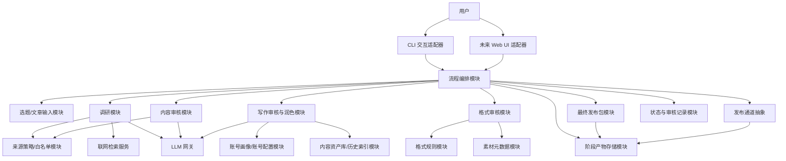
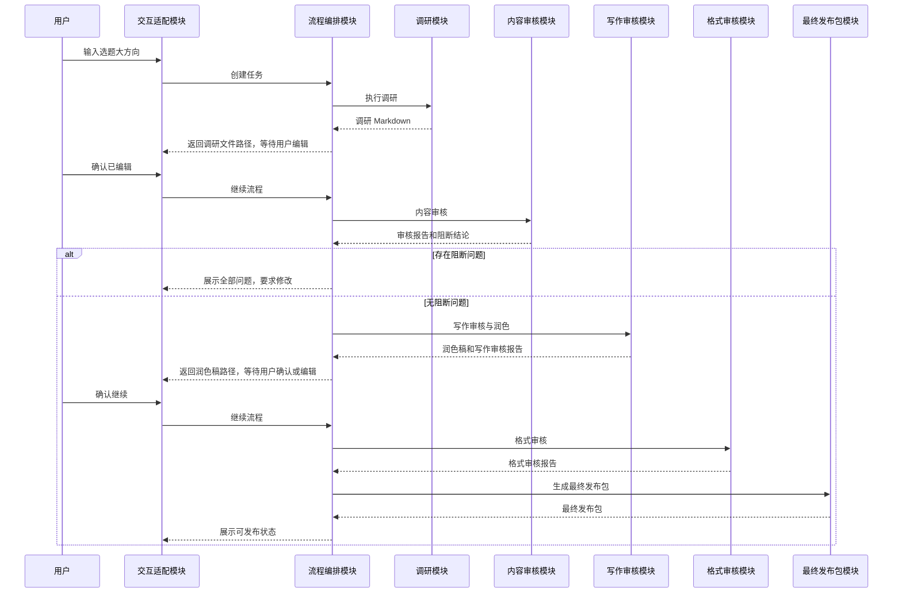
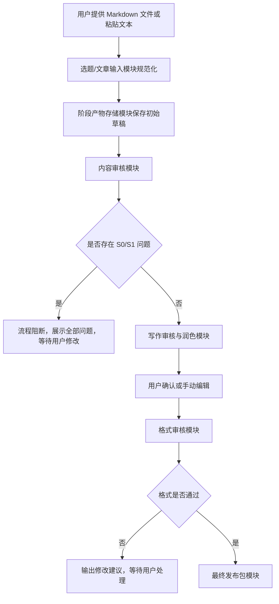

# 小红书医学/养生科普 Agent 概要设计文档

版本：v0.1  
日期：2026-06-04  
依据文档：[proposal.md](proposal.md)  
状态：概要设计草案  

## 1. 文档定位

本文档根据需求文档划分系统模块，描述模块职责、模块关系、核心数据流、关键状态和扩展点。

本文档不描述具体类结构、函数签名、提示词细节、数据库表结构、第三方库选型或完整测试用例。这些内容应在后续详细设计文档中展开。

## 2. 设计目标

系统默认形态为本地命令行 CLI 工具，使用 Markdown 文件作为主要阶段产物和人工编辑入口。

概要设计需要满足以下目标：

1. 支持“从选题大方向开始”和“从已有文章开始”两条主流程。
2. 将调研、内容审核、写作审核、格式审核、最终发布包生成解耦为独立模块。
3. 保留用户本地手动编辑和人工确认权。
4. 支持 OpenAI、DeepSeek 和兼容 `provider/base_url/model/api_key` 的 LLM 配置。
5. 支持权威医学来源优先级和可信度规则配置。
6. 支持账号画像、历史内容资产和系列化选题能力。
7. 将自动发布设计为可替换扩展，不绑定具体发布方式。
8. 为未来 Web UI 预留适配层，不让业务流程依赖 CLI。

## 3. 总体架构

系统采用分层结构：

1. 交互层：接收用户命令，展示状态、审核结果和确认提示。
2. 编排层：控制 Agent 阶段流转、阻断逻辑和人工确认。
3. 业务能力层：完成调研、审核、润色、格式检查、发布包生成等核心能力。
4. 基础服务层：提供 LLM 调用、联网检索、配置、文件存储、规则加载、日志和状态记录。
5. 扩展层：预留 Web UI、发布通道和其他外部系统接入。



## 4. 推荐目录结构

本设计推荐使用 `workspace` 目录保存每个选题或文章任务的阶段产物。

推荐结构如下：

```text
workspace/
  <topic_id>/
    metadata.yaml
    research/
      research.md
      sources.md
    drafts/
      draft.md
      revised.md
    reviews/
      content_review.md
      writing_review.md
      format_review.md
    package/
      final_package.md
      publish_manifest.yaml
    media/
      media_manifest.yaml
      images/
```

该结构是推荐约定，不是硬编码限制。实现时应允许同一阶段存在多份文件，例如多版调研资料、多版草稿、多次审核报告和多个发布包候选。

阶段产物存储模块应通过任务 ID、阶段、版本号、文件类型和时间戳管理文件，而不是依赖固定文件名判断流程状态。

## 5. 核心模块划分

### 5.1 交互适配模块

职责：

1. 提供默认 CLI 入口。
2. 接收用户输入的选题方向、已有文章路径、风格、账号、目标受众等参数。
3. 展示当前流程状态、阶段文件路径、审核结论和下一步操作。
4. 在需要用户编辑或确认时暂停流程。
5. 为未来 Web UI 保留统一的交互适配接口。

关系：

1. 只与流程编排模块交互。
2. 不直接调用调研、审核、LLM 或发布模块。
3. 不持有业务状态，只展示编排模块返回的状态和产物路径。

### 5.2 流程编排模块

职责：

1. 管理完整 Agent 工作流。
2. 支持从选题大方向开始或从已有文章开始。
3. 控制阶段流转、暂停、继续、重试和终止。
4. 根据内容审核结果执行阻断逻辑。
5. 在写作审核、格式审核和发布前要求用户确认。
6. 调用阶段产物存储模块保存每一步输出。
7. 调用状态与审核记录模块记录关键事件。

关系：

1. 上游接收交互适配模块请求。
2. 下游协调输入、调研、审核、润色、格式检查、发布包和发布通道模块。
3. 使用状态与审核记录模块判断当前任务是否可以继续。

### 5.3 选题/文章输入模块

职责：

1. 接收选题大方向。
2. 接收已有文章文本或 Markdown 文件。
3. 将输入规范化为内部任务元数据和初始阶段产物。
4. 记录目标受众、账号定位、写作风格、篇幅偏好和是否系列化等信息。

关系：

1. 由流程编排模块调用。
2. 输出任务元数据和初始 Markdown 产物到阶段产物存储模块。
3. 为调研模块或内容审核模块提供起点。

### 5.4 调研模块

职责：

1. 根据选题大方向生成检索计划。
2. 调用联网检索服务获取资料。
3. 使用来源策略/白名单模块评估来源可信度。
4. 整理核心结论、可引用事实、谨慎表达、不建议使用说法和来源清单。
5. 生成 Markdown 调研产物。
6. 记录检索时间、来源机构、来源链接、发布日期或“发布日期未知”。

关系：

1. 由流程编排模块调用。
2. 依赖联网检索服务、来源策略/白名单模块和 LLM 网关。
3. 输出调研资料到阶段产物存储模块。
4. 调研输出可被用户手动编辑，再进入内容审核。

### 5.5 来源策略/白名单模块

职责：

1. 维护权威来源优先级。
2. 维护医学来源可信度规则。
3. 支持白名单、灰名单和风险来源规则。
4. 为每条来源生成可信度说明。
5. 标记发布日期缺失、来源机构不明、证据不足或争议内容。

来源优先级至少覆盖：

1. 国家或地区卫生健康主管部门。
2. 权威医学指南。
3. 公立医院、大学医学中心和专业医学机构。
4. 学术期刊、系统综述和指南共识。
5. WHO、CDC 等国际公共卫生机构。
6. 其他可信健康科普来源。

关系：

1. 被调研模块用于筛选和排序来源。
2. 被内容审核模块用于事实核查和来源质量判断。
3. 规则应由配置或规则文件维护，避免写死在业务流程中。

### 5.6 内容审核模块

职责：

1. 审核医学事实、健康风险、平台合规和用户误导风险。
2. 输出所有问题，不论是否阻断。
3. 按 S0、S1、S2、S3 分级。
4. 对 S0 和 S1 问题进行流程阻断。
5. 为每个问题提供位置、原文片段、问题类型、风险说明、修改建议和是否阻断。
6. 生成内容审核报告。

关系：

1. 由流程编排模块调用。
2. 依赖 LLM 网关和来源策略/白名单模块。
3. 审核结果写入阶段产物存储模块和状态与审核记录模块。
4. 阻断结果由流程编排模块执行。

### 5.7 写作审核与润色模块

职责：

1. 在内容审核通过后进行小红书传播优化。
2. 根据风格配置生成通俗种草、专业严谨或平衡风格文案。
3. 优先优化点击率、关注转化、账号人设稳定性和系列化选题。
4. 输出标题候选、正文、开头优化说明、关注引导建议、互动引导建议和系列化选题建议。
5. 标记关键改写和仍需用户确认的表达。
6. 确保不因流量目标引入医学事实错误或夸大承诺。

关系：

1. 由流程编排模块在内容审核通过后调用。
2. 依赖 LLM 网关、账号画像/账号配置模块和内容资产库/历史索引模块。
3. 输出润色稿和写作审核报告到阶段产物存储模块。
4. 输出后可暂停，允许用户手动编辑。

### 5.8 格式审核模块

职责：

1. 检查小红书发布格式。
2. 覆盖标题、正文段落、话题标签、敏感词、表情符号、图片数量、封面标题、图片比例、图片与正文一致性和发布前必填项。
3. 读取格式规则模块中的可更新规则。
4. 读取素材元数据模块中的图片数量、比例、封面信息等。
5. 输出格式审核报告和是否可发布结论。
6. 对需要修改的问题给出建议，但不得绕过用户确认直接发布。

关系：

1. 由流程编排模块调用。
2. 依赖格式规则模块和素材元数据模块。
3. 结果写入阶段产物存储模块和状态与审核记录模块。

### 5.9 格式规则模块

职责：

1. 维护小红书格式检查规则。
2. 支持规则更新，适应平台规则变化。
3. 支持文本规则、标签规则、敏感词规则和素材规则。
4. 支持区分硬性阻断、建议修改和人工确认。

关系：

1. 被格式审核模块读取。
2. 规则来源可以是本地配置文件，具体格式由详细设计确定。
3. 不直接调用 LLM 或修改文章。

### 5.10 素材元数据模块

职责：

1. 管理图片素材清单。
2. 记录图片路径、数量、尺寸、比例、封面候选和图片说明。
3. 支持格式审核模块检查图片数量、比例和正文一致性。
4. 本阶段只做素材元数据校验，不负责图片生成、图片编辑或封面自动设计。

关系：

1. 被格式审核模块读取。
2. 输出素材检查信息到最终发布包模块。

### 5.11 最终发布包模块

职责：

1. 汇总最终标题、正文、话题标签、图片素材清单、封面标题、审核结论、来源清单和用户确认状态。
2. 判断是否允许进入发布阶段。
3. 生成最终发布包 Markdown 和发布清单。
4. 为手动复制发布和自动发布扩展提供统一输入。

关系：

1. 由流程编排模块在格式审核通过后调用。
2. 读取阶段产物存储模块中的最新确认版本。
3. 输出发布包到阶段产物存储模块。
4. 被发布通道抽象读取。

### 5.12 发布通道抽象模块

职责：

1. 定义发布扩展点。
2. 接收已通过审核并经用户确认的最终发布包。
3. 支持未来接入官方 API、浏览器自动化、第三方发布工具或其他发布方式。
4. 记录发布结果、失败原因和可重试状态。
5. 不绕过平台安全机制、风控机制或验证码。
6. 不保存明文账号密码。

关系：

1. 由流程编排模块在发布阶段调用。
2. 只读取最终发布包模块输出的结果。
3. 本阶段不实现具体小红书登录和发帖。

### 5.13 LLM 网关模块

职责：

1. 屏蔽不同 LLM 供应商差异。
2. 支持 OpenAI、DeepSeek 和兼容 `provider/base_url/model/api_key` 的供应商。
3. 统一处理模型调用、超时、重试和错误信息。
4. 避免业务模块直接读取 API Key。

关系：

1. 被调研、内容审核、写作审核等模块调用。
2. 读取配置管理模块提供的模型配置。
3. 不直接参与流程状态判断。

### 5.14 配置管理模块

职责：

1. 管理 LLM 配置、审核阈值、写作风格、格式规则路径、来源策略路径、账号配置路径等。
2. 支持环境变量和本地配置文件。
3. 确保 API Key、账号凭据等敏感信息不写死在代码中。
4. 在缺少必要配置时输出清晰错误。

关系：

1. 被 LLM 网关、来源策略、格式规则、账号画像等模块读取。
2. 不包含具体业务逻辑。

### 5.15 账号画像/账号配置模块

职责：

1. 管理账号定位、目标受众、语气风格、专业边界和关注转化策略。
2. 支持未来多账号和不同人设。
3. 为写作审核与润色模块提供账号一致性判断依据。
4. 为内容资产库建立账号维度的历史索引。

关系：

1. 被写作审核与润色模块读取。
2. 被内容资产库/历史索引模块用于区分账号内容。
3. 配置来源由配置管理模块指定。

### 5.16 内容资产库/历史索引模块

职责：

1. 保存历史选题、历史文案、标题、标签、账号画像、系列归属和审核结论索引。
2. 支持稳定人设和系列化选题。
3. 为写作审核提供历史风格参考。
4. 为后续内容复盘、选题库和发布后数据回收预留扩展。

关系：

1. 被写作审核与润色模块读取。
2. 被流程编排模块在任务完成后更新。
3. 与账号画像/账号配置模块关联。

### 5.17 阶段产物存储模块

职责：

1. 管理 Markdown 阶段产物和发布清单文件。
2. 支持同一任务同一阶段多个版本。
3. 为用户提供可手动编辑的文件路径。
4. 记录产物类型、阶段、版本、创建时间和来源阶段。

关系：

1. 被流程编排模块统一调用。
2. 被调研、审核、润色、格式审核和最终发布包模块写入。
3. 被发布通道抽象读取最终发布包。

### 5.18 状态与审核记录模块

职责：

1. 记录任务当前状态。
2. 保存关键审核记录。
3. 记录输入文件路径、审核时间、使用模型、阻断问题、非阻断问题和用户确认状态。
4. 支持流程续跑和失败重试。

关系：

1. 被流程编排模块读写。
2. 接收内容审核、格式审核和发布通道的结果。
3. 为交互适配模块提供状态展示数据。

### 5.19 联网检索服务

职责：

1. 为调研模块提供联网检索能力。
2. 返回标题、摘要、链接、来源、发布日期或更新时间等基础信息。
3. 支持失败重试和错误反馈。

关系：

1. 被调研模块调用。
2. 与来源策略/白名单模块配合完成来源筛选和可信度判断。

## 6. 核心流程设计

### 6.1 从选题大方向开始



### 6.2 从已有文章开始



## 7. 状态设计

任务状态由状态与审核记录模块维护。

建议状态如下：

| 状态 | 说明 |
| --- | --- |
| `created` | 任务已创建 |
| `researching` | 正在调研 |
| `waiting_research_edit` | 等待用户编辑调研资料 |
| `content_reviewing` | 正在内容审核 |
| `content_blocked` | 内容审核存在阻断问题 |
| `content_passed_with_warnings` | 内容审核通过但有非阻断问题 |
| `writing_reviewing` | 正在写作审核与润色 |
| `waiting_draft_edit` | 等待用户确认或编辑润色稿 |
| `format_reviewing` | 正在格式审核 |
| `format_blocked` | 格式审核未通过 |
| `package_ready` | 最终发布包已生成 |
| `waiting_publish_confirm` | 等待发布确认 |
| `publishing` | 正在发布 |
| `published` | 发布成功 |
| `publish_failed` | 发布失败 |

## 8. 数据与产物关系

核心数据对象在概要层面包括：

1. 任务元数据：任务 ID、输入类型、选题、目标受众、账号、风格、创建时间和当前状态。
2. 来源记录：链接、机构、发布日期、可信度、相关性、争议说明和检索时间。
3. 阶段产物：阶段、版本、文件路径、创建时间、来源产物和是否用户确认。
4. 审核问题：位置、原文片段、问题类型、严重程度、风险说明、修改建议和是否阻断。
5. 素材元数据：图片路径、尺寸、比例、封面候选、说明和检查结论。
6. 发布包：最终标题、正文、标签、素材清单、审核结论、来源清单和发布许可状态。
7. 账号画像：账号定位、目标人群、默认风格、禁用表达、常用结构和关注转化策略。
8. 历史内容索引：历史选题、发布包摘要、标签、系列归属、账号和审核结论。

## 9. 模块关系矩阵

| 模块 | 主要上游 | 主要下游 | 关键输出 |
| --- | --- | --- | --- |
| 交互适配模块 | 用户 | 流程编排模块 | 用户命令、确认信号 |
| 流程编排模块 | 交互适配模块 | 全部业务模块 | 阶段状态、流程决策 |
| 选题/文章输入模块 | 流程编排模块 | 阶段产物存储模块 | 初始任务产物 |
| 调研模块 | 流程编排模块 | 阶段产物存储模块 | 调研 Markdown |
| 来源策略/白名单模块 | 配置管理模块 | 调研模块、内容审核模块 | 来源可信度判断 |
| 内容审核模块 | 流程编排模块 | 状态与审核记录模块 | 内容审核报告 |
| 写作审核与润色模块 | 流程编排模块 | 阶段产物存储模块 | 润色稿、写作报告 |
| 格式审核模块 | 流程编排模块 | 状态与审核记录模块 | 格式审核报告 |
| 最终发布包模块 | 流程编排模块 | 发布通道抽象模块 | 最终发布包 |
| 发布通道抽象模块 | 流程编排模块 | 状态与审核记录模块 | 发布结果 |
| LLM 网关模块 | 配置管理模块 | 调研、审核、润色模块 | 模型响应 |
| 账号画像/账号配置模块 | 配置管理模块 | 写作审核模块、内容资产库 | 账号风格和人设 |
| 内容资产库/历史索引模块 | 流程编排模块 | 写作审核模块 | 历史内容参考 |
| 阶段产物存储模块 | 业务模块 | 流程编排模块、用户 | Markdown 文件路径 |
| 状态与审核记录模块 | 流程编排模块 | 交互适配模块 | 状态和审核记录 |

## 10. 人工确认点

系统应在以下节点暂停或要求确认：

1. 调研资料生成后，等待用户手动编辑或确认继续。
2. 内容审核存在 S0/S1 问题时，阻断并等待用户修改。
3. 内容审核只有 S2/S3 问题时，展示全部问题并允许用户确认继续。
4. 写作润色完成后，等待用户手动编辑或确认继续。
5. 格式审核存在需修改问题时，等待用户选择手动修改或授权生成修复稿。
6. 自动发布扩展启用时，发布前必须再次确认。

本阶段只保留普通用户人工确认，不引入人工专家复核模块。

## 11. 配置与规则

配置管理模块应覆盖以下配置类别：

1. LLM 配置：`provider`、`base_url`、`model`、`api_key`、`timeout`、`max_retries`。
2. 来源策略配置：权威来源优先级、白名单、风险来源规则、可信度说明规则。
3. 账号配置：账号 ID、账号定位、目标人群、默认风格、禁用表达和关注转化策略。
4. 写作配置：默认风格、标题候选数量、系列化建议开关。
5. 格式规则配置：标题、正文、标签、敏感词、表情符号、图片数量、图片比例和封面标题规则。
6. 存储配置：`workspace` 根目录、任务命名策略、版本保留策略。
7. 发布配置：发布通道类型、是否启用发布扩展、发布前确认策略。

敏感配置不得写死在代码中，也不得出现在版本控制记录中。

## 12. 自动发布扩展设计

自动发布在本阶段只作为扩展点。

发布通道抽象应满足：

1. 输入必须是最终发布包。
2. 最终发布包必须包含内容审核通过、格式审核通过和用户确认状态。
3. 发布前必须由流程编排模块确认用户授权。
4. 具体发布方式可替换。
5. 发布失败应返回失败原因和是否可重试。

候选发布通道包括：

1. 官方 API 通道。
2. 浏览器自动化通道。
3. 第三方发布工具通道。
4. 手动发布辅助通道。

如果未来采用浏览器自动化，应支持人工登录和人机验证人工介入，不应绕过平台安全机制。

## 13. Web UI 预留方式

系统默认使用 CLI，但业务流程不应直接依赖 CLI 输入输出。

预留方式：

1. 将 CLI 作为交互适配模块的一种实现。
2. 流程编排模块对外暴露任务创建、继续、确认、重试、读取状态等能力。
3. 阶段产物存储模块提供文件路径和产物元数据，方便未来 Web UI 展示。
4. 状态与审核记录模块提供结构化状态，方便未来 Web UI 渲染进度。
5. 人工确认点由流程编排模块统一管理，CLI 和 Web UI 只负责呈现和提交确认。

## 14. 错误处理原则

系统应在以下场景给出明确错误：

1. LLM 配置缺失或调用失败。
2. 联网检索失败。
3. 来源信息不完整。
4. 用户指定的 Markdown 文件不存在或不可读。
5. 阶段产物版本冲突。
6. 内容审核出现阻断问题。
7. 格式审核未通过。
8. 素材文件缺失或元数据不足。
9. 发布通道不可用或发布失败。

错误处理应优先返回可操作的下一步，例如修改文件、补充配置、重新审核或回退到手动发布。

## 15. 需求追踪

| 需求编号 | 覆盖模块 |
| --- | --- |
| FR-001 | 选题/文章输入模块、交互适配模块 |
| FR-002 | 调研模块、联网检索服务、来源策略/白名单模块 |
| FR-003 | 调研模块、阶段产物存储模块 |
| FR-004 | 交互适配模块、流程编排模块、阶段产物存储模块 |
| FR-005 | 选题/文章输入模块、阶段产物存储模块 |
| FR-006 | 内容审核模块、状态与审核记录模块 |
| FR-007 | 内容审核模块、流程编排模块 |
| FR-008 | 内容审核模块、交互适配模块 |
| FR-009 | 写作审核与润色模块、账号画像/账号配置模块、内容资产库/历史索引模块 |
| FR-010 | 写作审核与润色模块、阶段产物存储模块 |
| FR-011 | 格式审核模块、格式规则模块、素材元数据模块 |
| FR-012 | 格式审核模块、流程编排模块、交互适配模块 |
| FR-013 | 最终发布包模块、阶段产物存储模块 |
| FR-014 | 发布通道抽象模块、流程编排模块 |
| FR-015 | LLM 网关模块、配置管理模块 |
| FR-016 | 配置管理模块、LLM 网关模块 |
| FR-017 | 状态与审核记录模块 |
| FR-018 | 状态与审核记录模块、交互适配模块、流程编排模块 |

## 16. 后续详细设计待展开事项

以下内容应在详细设计文档中继续展开：

1. Python 包结构和模块文件划分。
2. CLI 命令设计和参数设计。
3. 任务 ID、版本号和阶段产物命名规则。
4. 配置文件格式、加载优先级和密钥读取方式。
5. LLM 网关的统一请求和响应结构。
6. 来源策略规则文件格式。
7. 内容审核、写作审核和格式审核的结构化输出格式。
8. 素材元数据文件格式。
9. 最终发布包结构。
10. 发布通道抽象接口。
11. 状态持久化方案。
12. 测试策略和验收用例。

